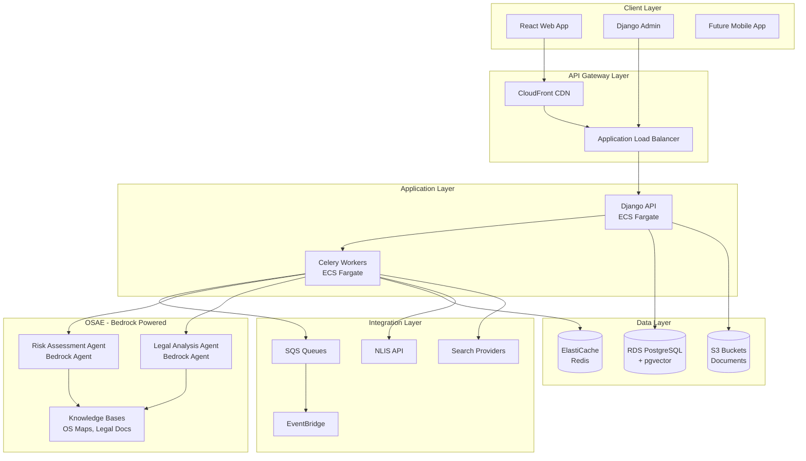

# Strategic Backend Design Option 1: AWS Bedrock-Powered Architecture

## Executive Summary

This design leverages AWS managed services, particularly Bedrock, to minimize operational overhead while maximizing scalability. The architecture prioritizes rapid development, cost efficiency, and maintainability by using serverless and managed services wherever possible.

- **Key Technologies:** Django, AWS Bedrock, ECS Fargate, RDS PostgreSQL, S3, SQS, EventBridge
- **Monthly Cost Estimate:** £850-1,200
- **Time to MVP:** 8-10 weeks
- **Team Size Required:** 2-3 developers

## System Architecture Overview



## Detailed Workflow Architecture

### Phase 1: Property Identification & Risk Assessment

```yaml
Trigger: Property Added
Actor: Estate Agent
System Flow: Django API → SQS → OSAE Risk Assessment Agent

OSAE Actions:
  1. Property Identification:
    - UPRN lookup
    - Title number extraction
    - Boundary determination

  2. Risk Analysis (RAG-powered):
    - Query: "Historical subsidence within 500m of {postcode}"
    - Query: "Flood risk zone for {coordinates}"
    - Query: "Mining activity history in {area}"
    - Query: "Planning applications nearby {address}"

  3. Search Recommendation Engine:
    - Core searches (LLC1, CON29)
    - Environmental (flooding, contamination)
    - Location-specific (mining, chancel repair)
    - Property-specific (commons registration)

Output: Risk Assessment Report + Search Checklist
Cost: £180-450 (itemized)
```

### Phase 2: Search Orchestration

```yaml
OSAE Search Coordinator:

Search Priority Matrix:
  Critical: [LLC1, CON29] - 3-5 days
  Important: [Environmental, Water] - 5-7 days
  Conditional: [Mining, Chancel] - 7-10 days

API Integrations:
  - NLIS Hub (LLC1, CON29)
  - Groundsure (Environmental)
  - Coal Authority (Mining)
  - Index Map (Commons)
  - Water Companies (Drainage)

Status Tracking:
  - Pending submission
  - Submitted to provider
  - Provider processing
  - Results received
  - Analysis in progress
  - Complete with findings
```

### Phase 3: Legal Analysis and Compliance

```yaml
OSAE Legal Agent:

RAG Knowledge Sources:
  - CML Lender Handbook (all parts)
  - Law Society Conveyancing Protocol
  - Ombudsman case decisions (5 years)
  - Local authority specific requirements
  - Recent regulatory changes

Analysis Pipeline:
  1. Parse search results
  2. Extract key data points
  3. RAG Query: "Lender requirements for {issue_type}"
  4. RAG Query: "Precedent cases similar to {finding}"
  5. Generate risk matrix
  6. Create actionable recommendations

Output: Legal Analysis Report
Recipients: Seller, Agent, Solicitor
```

### RAG

```yaml
Knowledge Base Structure:

Static Knowledge (S3 + OpenSearch): /os-maps/
  - Flood risk zones
  - Historical subsidence
  - Geographic features

  /legal-documents/
  - CML Handbook (chunked)
  - Conveyancing Protocol
  - Case law database

  /search-templates/
  - Provider requirements
  - Search type definitions

Dynamic Knowledge (RDS + pgvector):
  - Previous search results
  - Solicitor annotations
  - Issue resolutions
  - Local peculiarities

Embedding Strategy:
  - Legal documents: Legal-BERT embeddings
  - Geographic data: Geospatial embeddings
  - Search results: Standard text embeddings

Retrieval Pipeline: 1. Semantic search (top 20)
  2. Metadata filtering (jurisdiction, date)
  3. Re-ranking (relevance + recency)
  4. Context assembly (8K tokens max)
```
