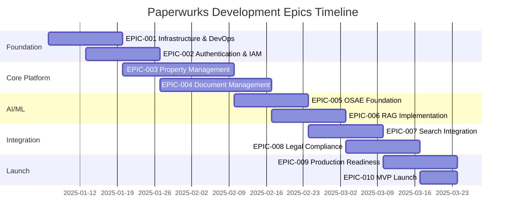

# Paperwurks Sprint Plan & Epics

## Project Overview

Building a property due diligence platform that automates document collection, AI-powered analysis, and search orchestration for UK property transactions.

## Project Timeline

- **Duration:** 12 weeks (3 months) for MVP
- **Methodology:** Agile with 2-week sprints
- **Team Size:** 2-3 developers
- **Start Date:** January 2025
- **MVP Launch:** April 2025

## 📋 Epic Overview

## 🎯 Epic Definitions

### EPIC-001: Infrastructure & DevOps Foundation

**Priority:** P0 - Critical
**Sprint:** Sprint 0-1
**Team:** DevOps Lead + Backend Dev
**Dependencies:** None

#### Description

Establish the complete cloud infrastructure, CI/CD pipelines, and development environment for Paperwurks platform.

#### Success Criteria

- AWS infrastructure provisioned and secured
- Development, staging, and production environments operational
- CI/CD pipeline deploying automatically
- Monitoring and alerting configured
- Team can develop and deploy code

#### User Stories

| ID     | Story                                                                             | Points | Priority |
| ------ | --------------------------------------------------------------------------------- | ------ | -------- |
| US-001 | As a developer, I need AWS infrastructure so I can deploy applications            | 8      | P0       |
| US-002 | As a developer, I need CI/CD pipeline so deployments are automated                | 5      | P0       |
| US-003 | As a DevOps engineer, I need monitoring so I can track system health              | 5      | P0       |
| US-004 | As a developer, I need local development environment so I can develop efficiently | 3      | P0       |
| US-005 | As a CTO, I need infrastructure documentation so team understands architecture    | 3      | P1       |

### EPIC-002: Authentication & Identity Management

**Priority:** P0 - Critical
**Sprint:** Sprint 1
**Team:** Backend Dev
**Dependencies:** EPIC-001

#### Description

Implement multi-role authentication system with JWT tokens, role-based access control, and compliance audit logging.

#### Success Criteria

- Users can register and login securely
- JWT authentication working with refresh tokens
- Role-based permissions enforced
- Password reset flow functional
- All authentication events logged for audit

#### User Stories

| ID     | Story                                                                           | Points | Priority |
| ------ | ------------------------------------------------------------------------------- | ------ | -------- |
| US-006 | As a user, I need to register an account so I can access the platform           | 5      | P0       |
| US-007 | As a user, I need to login securely so my data is protected                     | 5      | P0       |
| US-008 | As an admin, I need role-based access control so users see appropriate features | 8      | P0       |
| US-009 | As a user, I need to reset my password so I can recover account access          | 3      | P0       |
| US-010 | As a compliance officer, I need audit logs so I can track user actions          | 5      | P0       |

### EPIC-003: Property Management System

**Priority:** P0 - Critical
**Sprint:** Sprint 2-3
**Team:** Full Team
**Dependencies:** EPIC-002

#### Description

Create comprehensive property management system allowing agents to create properties, manage listings, and track transaction progress.

#### Success Criteria

- Agents can create and manage properties
- UPRN integration functioning
- Property assignment workflow operational
- Status tracking and transitions working
- Dashboard showing all property metrics

#### User Stories

| ID     | Story                                                                       | Points | Priority |
| ------ | --------------------------------------------------------------------------- | ------ | -------- |
| US-011 | As an agent, I need to create property listings so I can start transactions | 8      | P0       |
| US-012 | As an agent, I need to search properties by postcode so I can find listings | 5      | P0       |
| US-013 | As an agent, I need to assign solicitors to properties so they can review   | 5      | P0       |
| US-014 | As an agent, I need to track property status so I know transaction progress | 5      | P1       |
| US-015 | As an agent, I need property dashboard so I can manage portfolio            | 8      | P1       |
| US-016 | As a system, I need UPRN validation so property data is accurate            | 5      | P1       |

### EPIC-004: Document Management System

**Priority:** P0 - Critical
**Sprint:** Sprint 2-3
**Team:** Backend Dev + Frontend Dev
**Dependencies:** EPIC-003

#### Description

Implement secure document upload, storage, and management system with S3 integration and document versioning.

#### Success Criteria

- Users can upload documents securely to S3
- Document categorization and metadata working
- Version control for documents
- Document viewing and downloading functional
- Access control per user role

#### User Stories

| ID     | Story                                                                          | Points | Priority |
| ------ | ------------------------------------------------------------------------------ | ------ | -------- |
| US-017 | As a seller, I need to upload property documents so they can be reviewed       | 8      | P0       |
| US-018 | As a user, I need to categorize documents so they are organized                | 3      | P0       |
| US-019 | As a user, I need to download documents so I can review offline                | 3      | P0       |
| US-020 | As a system, I need to generate secure upload URLs so uploads are direct to S3 | 5      | P0       |
| US-021 | As an agent, I need to see document upload progress so I know pack status      | 5      | P1       |
| US-022 | As a solicitor, I need document versioning so I can track changes              | 5      | P1       |

### EPIC-005: OSAE Foundation (AI Risk Assessment)

**Priority:** P0 - Critical
**Sprint:** Sprint 3-4
**Team:** AI/Backend Lead
**Dependencies:** EPIC-004

#### Description

Implement the Official Search Automation Engine for automated property risk assessment using AWS Bedrock.

#### Success Criteria

- Risk Assessment Agent operational
- Integration with Bedrock configured
- Knowledge bases populated with OS data
- Risk reports generated automatically
- Search recommendations provided

#### User Stories

| ID     | Story                                                                    | Points | Priority |
| ------ | ------------------------------------------------------------------------ | ------ | -------- |
| US-023 | As an agent, I need automated risk assessment so I can advise clients    | 13     | P0       |
| US-024 | As a system, I need to analyze property location for environmental risks | 8      | P0       |
| US-025 | As an agent, I need search recommendations based on property risks       | 8      | P0       |
| US-026 | As an agent, I need cost estimates for recommended searches              | 5      | P1       |
| US-027 | As a seller, I need to understand property risks before proceeding       | 5      | P1       |

### EPIC-006: RAG Implementation

**Priority:** P0 - Critical
**Sprint:** Sprint 3-4
**Team:** AI/Backend Lead
**Dependencies:** EPIC-005

#### Description

Implement Retrieval-Augmented Generation system for intelligent document analysis and knowledge retrieval.

#### Success Criteria

- Document ingestion pipeline working
- Vector store configured and operational
- Semantic search functioning
- Knowledge bases integrated with agents
- Context retrieval accurate and fast

#### User Stories

| ID     | Story                                                                     | Points | Priority |
| ------ | ------------------------------------------------------------------------- | ------ | -------- |
| US-028 | As a system, I need to ingest and index documents for retrieval           | 8      | P0       |
| US-029 | As an agent, I need semantic search across all property documents         | 8      | P0       |
| US-030 | As a system, I need to chunk documents intelligently for better retrieval | 5      | P0       |
| US-031 | As a system, I need to generate embeddings for similarity search          | 5      | P0       |
| US-032 | As an agent, I need relevant context retrieved for any query              | 8      | P1       |

### EPIC-007: Search Provider Integration

**Priority:** P0 - Critical
**Sprint:** Sprint 4-5
**Team:** Backend Dev
**Dependencies:** EPIC-005

#### Description

Integrate with NLIS and other search providers for ordering official property searches and tracking results.

#### Success Criteria

- NLIS API integration complete
- Search ordering workflow functional
- Status tracking via webhooks
- Search results stored and parsed
- Cost calculation accurate

#### User Stories

| ID     | Story                                                                     | Points | Priority |
| ------ | ------------------------------------------------------------------------- | ------ | -------- |
| US-033 | As an agent, I need to order LLC1 and CON29 searches through NLIS         | 8      | P0       |
| US-034 | As an agent, I need to track search status in real-time                   | 5      | P0       |
| US-035 | As a seller, I need to approve search costs before ordering               | 5      | P0       |
| US-036 | As a system, I need to handle search provider webhooks for status updates | 8      | P0       |
| US-037 | As an agent, I need to download completed search results                  | 3      | P0       |
| US-038 | As a system, I need to retry failed search orders automatically           | 5      | P1       |

### EPIC-008: Legal Compliance Engine

**Priority:** P0 - Critical
**Sprint:** Sprint 5
**Team:** AI/Backend Lead
**Dependencies:** EPIC-007

#### Description

Implement legal analysis agent for interpreting search results against lender requirements and compliance standards.

#### Success Criteria

- Legal Analysis Agent operational
- CML Handbook knowledge base integrated
- Search result interpretation automated
- Compliance issues identified
- Solicitor review workflow working

#### User Stories

| ID     | Story                                                           | Points | Priority |
| ------ | --------------------------------------------------------------- | ------ | -------- |
| US-039 | As a solicitor, I need AI analysis of search results for issues | 13     | P0       |
| US-040 | As a solicitor, I need lender requirement compliance checks     | 8      | P0       |
| US-041 | As a solicitor, I need to annotate and override AI findings     | 5      | P0       |
| US-042 | As a system, I need to match issues with legal precedents       | 8      | P1       |
| US-043 | As a solicitor, I need to approve property packs after review   | 5      | P0       |

### EPIC-009: Production Readiness

**Priority:** P0 - Critical
**Sprint:** Sprint 6
**Team:** Full Team
**Dependencies:** EPIC-001 through EPIC-008

#### Description

Prepare platform for production launch including performance optimization, security hardening, and operational readiness.

#### Success Criteria

- Performance benchmarks met
- Security audit passed
- GDPR compliance verified
- Monitoring comprehensive
- Documentation complete

#### User Stories

| ID     | Story                                                                         | Points | Priority |
| ------ | ----------------------------------------------------------------------------- | ------ | -------- |
| US-044 | As a CTO, I need load testing completed so system can handle expected traffic | 8      | P0       |
| US-045 | As a CTO, I need security penetration testing so platform is secure           | 8      | P0       |
| US-046 | As a compliance officer, I need GDPR compliance so we meet regulations        | 8      | P0       |
| US-047 | As a DevOps engineer, I need comprehensive monitoring dashboards              | 5      | P0       |
| US-048 | As a developer, I need API documentation so integrators understand system     | 5      | P0       |
| US-049 | As a support agent, I need user documentation so I can help customers         | 5      | P1       |

### EPIC-010: MVP Launch

**Priority:** P0 - Critical
**Sprint:** Sprint 6
**Team:** Full Team
**Dependencies:** EPIC-009

#### Description

Launch MVP with first customers including onboarding, training, and initial transaction processing.

#### Success Criteria

- 5 estate agents onboarded
- 5 solicitors active
- First property transaction completed
- Customer feedback collected
- Support processes operational

#### User Stories

| ID     | Story                                                                   | Points | Priority |
| ------ | ----------------------------------------------------------------------- | ------ | -------- |
| US-050 | As a customer success manager, I need onboarding process for new agents | 5      | P0       |
| US-051 | As a new user, I need training materials so I can use platform          | 5      | P0       |
| US-052 | As a customer, I need support channel so I can get help                 | 3      | P0       |
| US-053 | As a product owner, I need feedback mechanism so we can improve         | 3      | P0       |
| US-054 | As a CTO, I need production metrics so we can track success             | 5      | P0       |

## 🏃 Sprint Breakdown

### Sprint 0: Foundation Setup (Week 1-2)

**Goal:** Infrastructure and development environment ready
**Epic:** EPIC-001
**Capacity:** 2 developers × 10 days = 20 points

#### Committed Stories

| Story ID  | Points | Assignee    | Status      |
| --------- | ------ | ----------- | ----------- |
| US-001    | 8      | DevOps Lead | Not Started |
| US-002    | 5      | DevOps Lead | Not Started |
| US-004    | 3      | Backend Dev | Not Started |
| US-003    | 5      | DevOps Lead | Not Started |
| **Total** | **21** |             |             |

#### Sprint Goals

- AWS infrastructure operational
- CI/CD pipeline deploying to staging
- Local development environment documented
- Team able to deploy code

### Sprint 1: Authentication System (Week 3-4)

**Goal:** Complete authentication and authorization
**Epic:** EPIC-002
**Capacity:** 3 developers × 10 days = 30 points

#### Committed Stories

| Story ID  | Points | Assignee     | Status      |
| --------- | ------ | ------------ | ----------- |
| US-006    | 5      | Backend Dev  | Not Started |
| US-007    | 5      | Backend Dev  | Not Started |
| US-008    | 8      | Backend Lead | Not Started |
| US-009    | 3      | Backend Dev  | Not Started |
| US-010    | 5      | Backend Lead | Not Started |
| **Total** | **26** |              |             |

#### Sprint Goals

- User registration and login working
- JWT authentication implemented
- RBAC system operational
- Audit logging configured

### Sprint 2: Property & Document Core (Week 5-6)

**Goal:** Property creation and document upload
**Epic:** EPIC-003, EPIC-004
**Capacity:** 3 developers × 10 days = 30 points

#### Committed Stories

| Story ID  | Points | Assignee       | Status      |
| --------- | ------ | -------------- | ----------- |
| US-011    | 8      | Full Stack Dev | Not Started |
| US-012    | 5      | Backend Dev    | Not Started |
| US-017    | 8      | Backend Dev    | Not Started |
| US-020    | 5      | Backend Dev    | Not Started |
| US-018    | 3      | Frontend Dev   | Not Started |
| **Total** | **29** |                |             |

#### Sprint Goals

- Property CRUD operations complete
- Document upload to S3 working
- Basic property dashboard
- Document categorization functional

### Sprint 3: AI Foundation & RAG (Week 7-8)

**Goal:** OSAE risk assessment and RAG implementation
**Epic:** EPIC-005, EPIC-006
**Capacity:** 3 developers × 10 days = 30 points

#### Committed Stories

| Story ID  | Points | Assignee    | Status      |
| --------- | ------ | ----------- | ----------- |
| US-023    | 13     | AI Lead     | Not Started |
| US-028    | 8      | AI Lead     | Not Started |
| US-030    | 5      | Backend Dev | Not Started |
| US-031    | 5      | Backend Dev | Not Started |
| **Total** | **31** |             |             |

#### Sprint Goals

- Risk Assessment Agent live
- RAG pipeline operational
- Knowledge bases populated
- First risk assessment generated

### Sprint 4: Search Integration (Week 9-10)

**Goal:** Complete search provider integration
**Epic:** EPIC-007
**Capacity:** 3 developers ×
