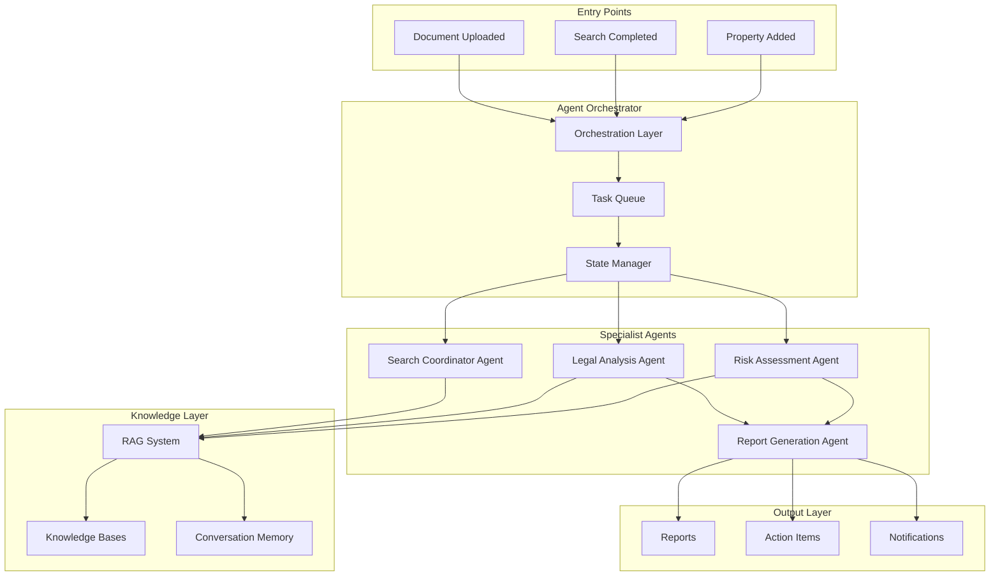
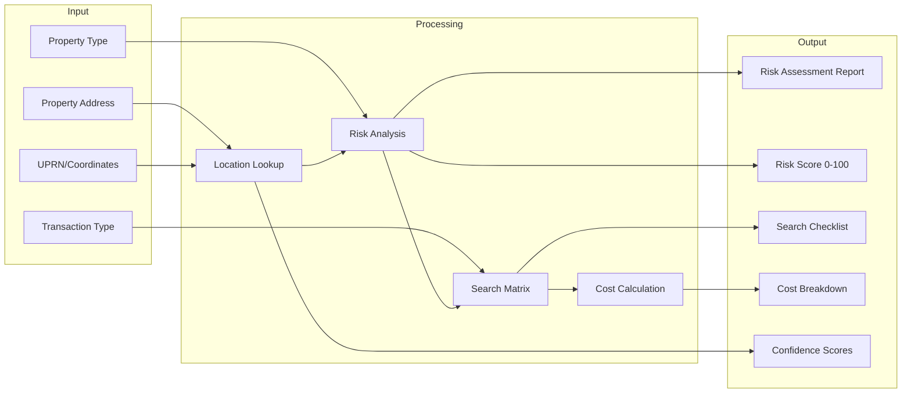
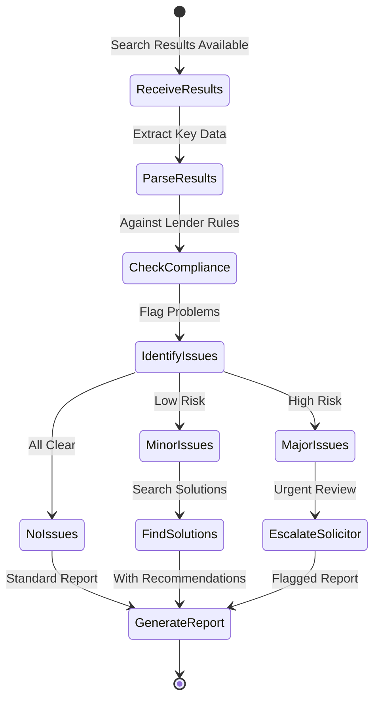
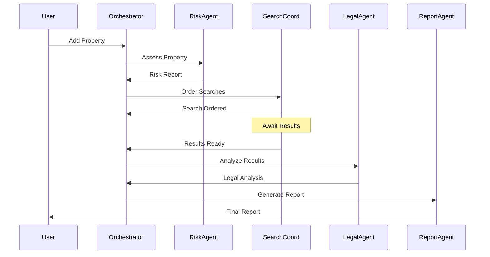
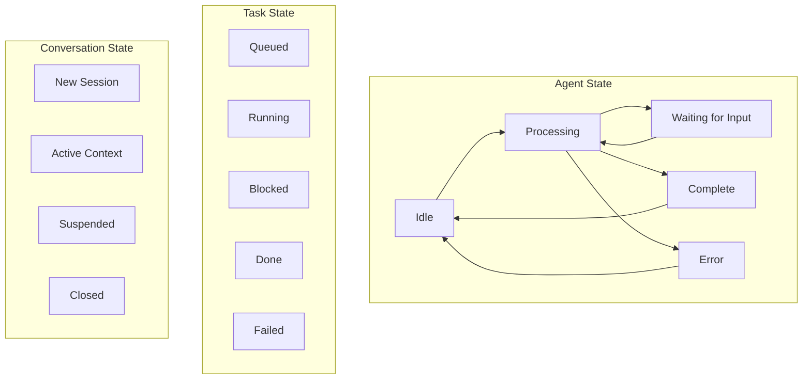
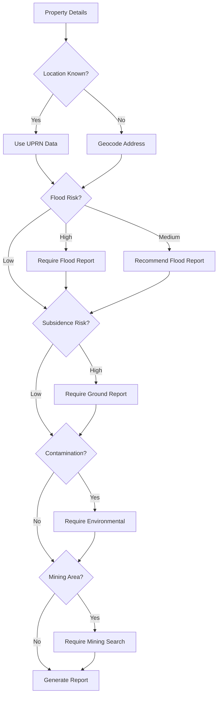
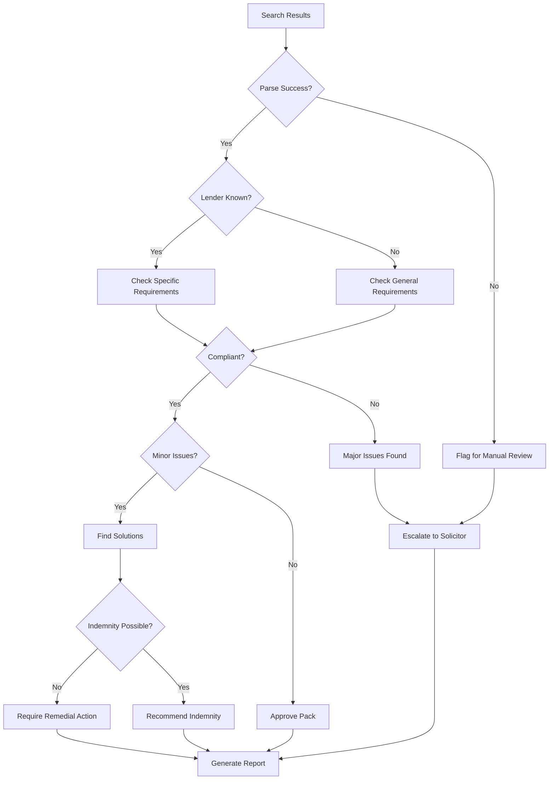
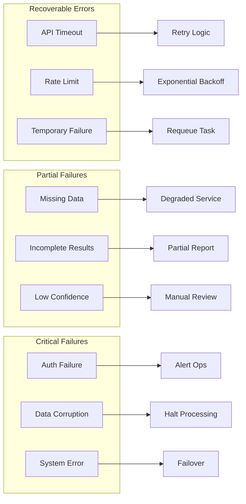

# OSAE Design Document

## Document Information

- **Version:** 1.0.0
- **Last Updated:** January 2025
- **Status:** Approved for Implementation
- **Target Sprints:** Sprint 3 (Foundation), Sprint 4-5 (Agents), Sprint 6 (Optimization)

## Executive Summary

The Official Search Automation Engine (OSAE) is Paperwurks' intelligent agent system that automates property risk assessment, search orchestration, and legal compliance analysis. This document defines the architecture, agent behaviors, and integration patterns.

## OSAE Architecture Overview

## Agent Definitions

### Risk Assessment Agent

#### Purpose

Analyzes property location and characteristics to identify potential risks and recommend necessary searches.

#### Capabilities

| Capability                | Description                    | Data Sources                   | Sprint   |
| ------------------------- | ------------------------------ | ------------------------------ | -------- |
| Location Analysis         | Assess geographic risks        | OS maps, flood data            | Sprint 3 |
| Environmental Screening   | Identify environmental hazards | EA data, contamination records | Sprint 3 |
| Infrastructure Assessment | Check nearby developments      | Planning portal, HS2 routes    | Sprint 3 |
| Historical Analysis       | Review area history            | Historical maps, mining data   | Sprint 3 |
| Search Recommendation     | Recommend relevant searches    | Search matrix, risk factors    | Sprint 3 |
| Cost Estimation           | Estimate total search costs    | Provider pricing, complexity   | Sprint 3 |

#### Input/Output Schema

#### Risk Categories

| Category      | Risk Factors                       | Weight | Threshold    | Sprint   |
| ------------- | ---------------------------------- | ------ | ------------ | -------- |
| Flooding      | River, surface, groundwater        | 25%    | >1% annual   | Sprint 3 |
| Subsidence    | Clay soil, tree proximity, history | 20%    | Medium+ risk | Sprint 3 |
| Contamination | Industrial history, landfill       | 20%    | Within 250m  | Sprint 3 |
| Mining        | Coal, other minerals, cavities     | 15%    | Any activity | Sprint 3 |
| Planning      | Major developments, HS2, airports  | 10%    | Within 1km   | Sprint 3 |
| Environmental | Radon, conservation, flood defense | 10%    | Various      | Sprint 3 |

### Legal Analysis Agent

#### Purpose

Interprets search results against lender requirements and legal compliance standards.

#### Capabilities

| Capability            | Description                         | Knowledge Base                 | Sprint   |
| --------------------- | ----------------------------------- | ------------------------------ | -------- |
| Search Interpretation | Parse and understand search results | Search templates               | Sprint 5 |
| Lender Compliance     | Check against CML handbook          | CML handbook, lender specifics | Sprint 5 |
| Issue Identification  | Flag potential legal issues         | Case precedents, protocols     | Sprint 5 |
| Risk Scoring          | Assess legal risk level             | Risk matrix, historical data   | Sprint 5 |
| Recommendation Engine | Suggest remedial actions            | Best practices, solutions DB   | Sprint 5 |
| Precedent Matching    | Find similar resolved cases         | Case database                  | Sprint 5 |

#### Analysis Workflow

#### Compliance Rules Engine

| Rule Type        | Description                | Source          | Action              | Sprint   |
| ---------------- | -------------------------- | --------------- | ------------------- | -------- |
| Lender Mandatory | Must-have requirements     | CML Part 1      | Block if missing    | Sprint 5 |
| Lender Specific  | Individual lender rules    | CML Part 2      | Check if applicable | Sprint 5 |
| Legal Required   | Statutory requirements     | Legislation     | Ensure compliance   | Sprint 5 |
| Best Practice    | Recommended practices      | Law Society     | Suggest if missing  | Sprint 5 |
| Local Peculiar   | Area-specific requirements | Local knowledge | Flag if relevant    | Sprint 5 |

### Search Coordinator Agent

#### Purpose

Orchestrates the ordering, tracking, and management of property searches across multiple providers.

#### Capabilities

| Capability         | Description                           | Integration         | Sprint   |
| ------------------ | ------------------------------------- | ------------------- | -------- |
| Provider Selection | Choose optimal provider per search    | Provider matrix     | Sprint 4 |
| Batch Ordering     | Group searches for efficiency         | API orchestration   | Sprint 4 |
| Status Tracking    | Monitor search progress               | Webhook/polling     | Sprint 4 |
| Cost Optimization  | Find best price/speed balance         | Pricing engine      | Sprint 4 |
| Retry Logic        | Handle failures gracefully            | Exponential backoff | Sprint 4 |
| Result Aggregation | Compile results from multiple sources | Data normalizer     | Sprint 4 |

#### Search Priority Matrix

[Mermaid for Search Priority Matrix here]

### Report Generation Agent

#### Purpose

Creates comprehensive, readable reports from agent analyses for different stakeholders.

#### Capabilities

| Capability          | Description                | Output Format    | Sprint   |
| ------------------- | -------------------------- | ---------------- | -------- |
| Audience Adaptation | Tailor content for role    | Role-specific    | Sprint 5 |
| Risk Summarization  | Executive summary of risks | Traffic light    | Sprint 5 |
| Action Items        | Clear next steps           | Prioritized list | Sprint 5 |
| Timeline Generation | Project completion dates   | Gantt/timeline   | Sprint 6 |
| Cost Breakdown      | Detailed cost analysis     | Itemized table   | Sprint 4 |
| Confidence Scoring  | Reliability indicators     | Percentage/stars | Sprint 5 |

## Agent Communication Patterns

### Inter-Agent Communication

### State Management

## Decision Trees

### Risk Assessment Decision Tree

### Legal Compliance Decision Tree

## Performance Specifications

### Response Time Requirements

| Agent Operation   | Target | Maximum | Retry After | Sprint   |
| ----------------- | ------ | ------- | ----------- | -------- |
| Risk Assessment   | 15s    | 30s     | 60s         | Sprint 3 |
| Search Ordering   | 5s     | 10s     | 30s         | Sprint 4 |
| Legal Analysis    | 30s    | 60s     | 120s        | Sprint 5 |
| Report Generation | 10s    | 20s     | 60s         | Sprint 5 |
| Status Check      | 1s     | 3s      | 10s         | Sprint 4 |

### Throughput Requirements

| Metric              | Target | Peak | Degraded Mode | Sprint   |
| ------------------- | ------ | ---- | ------------- | -------- |
| Properties/hour     | 100    | 500  | 50            | Sprint 3 |
| Searches/hour       | 200    | 1000 | 100           | Sprint 4 |
| Reports/hour        | 50     | 200  | 25            | Sprint 5 |
| Concurrent sessions | 20     | 100  | 10            | Sprint 3 |

## Error Handling

### Error Categories

### Fallback Strategies

| Scenario                | Primary          | Fallback 1         | Fallback 2   | Manual         | Sprint   |
| ----------------------- | ---------------- | ------------------ | ------------ | -------------- | -------- |
| RAG Unavailable         | Bedrock KB       | Cached results     | Basic rules  | Human review   | Sprint 3 |
| Search API Down         | Primary provider | Secondary provider | Manual order | Phone order    | Sprint 4 |
| AI Model Error          | Primary model    | Simpler model      | Rule engine  | Human analysis | Sprint 3 |
| Report Generation Fails | Full report      | Summary only       | Raw data     | Email data     | Sprint 5 |

## Monitoring & Observability

### Key Metrics

| Metric            | Description            | Alert Threshold | Dashboard  | Sprint   |
| ----------------- | ---------------------- | --------------- | ---------- | -------- |
| Agent Latency     | Time per operation     | >2x target      | Operations | Sprint 3 |
| Success Rate      | Successful completions | <95%            | Business   | Sprint 3 |
| Confidence Score  | Average confidence     | <70%            | Quality    | Sprint 3 |
| Queue Depth       | Pending tasks          | >100            | Operations | Sprint 3 |
| Error Rate        | Failures per hour      | >5%             | Operations | Sprint 3 |
| Cost per Analysis | AI service costs       | >£5             | Finance    | Sprint 3 |
