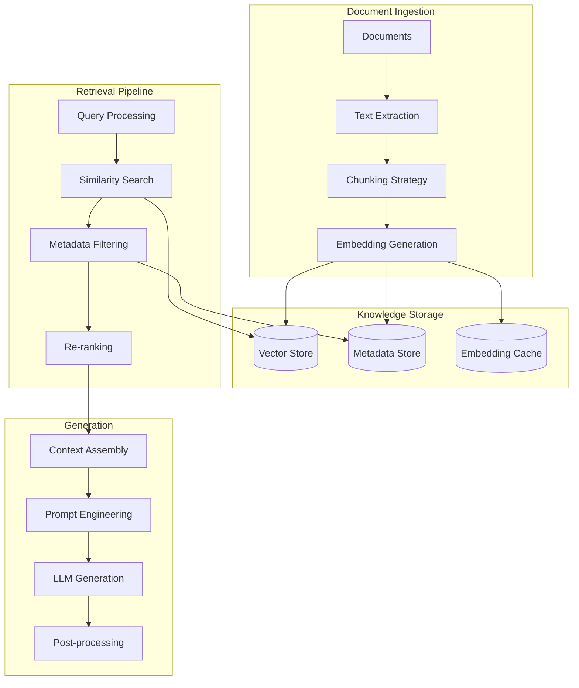
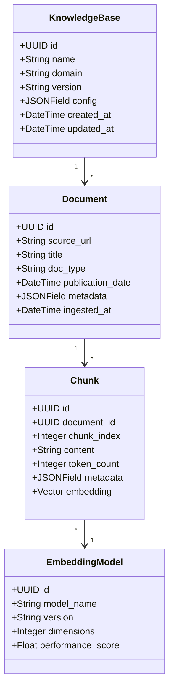
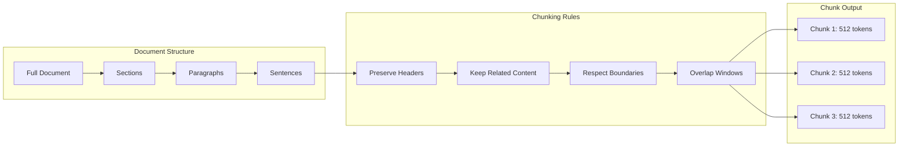
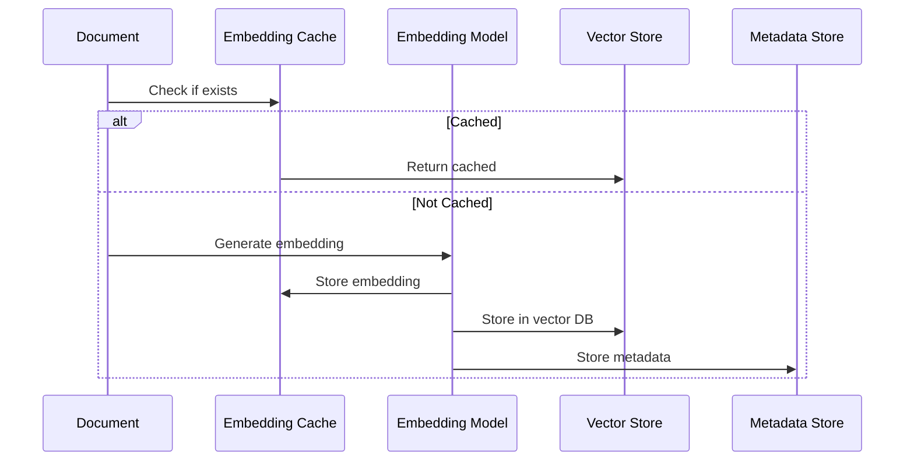
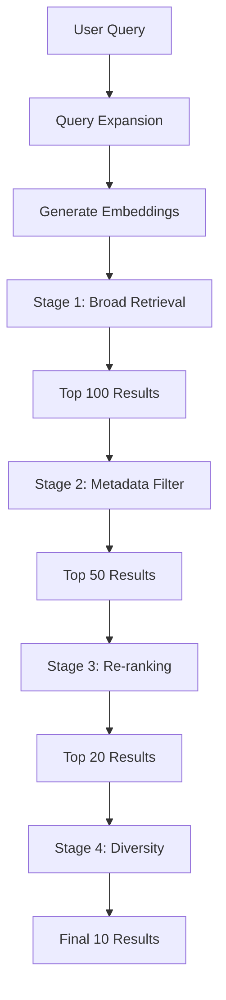
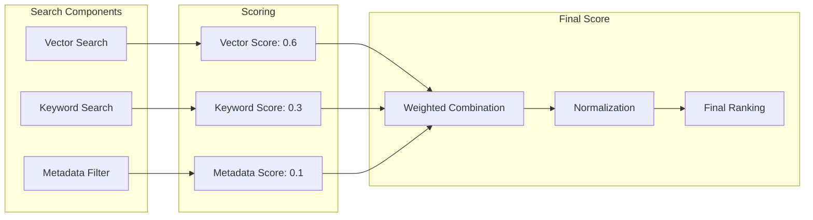
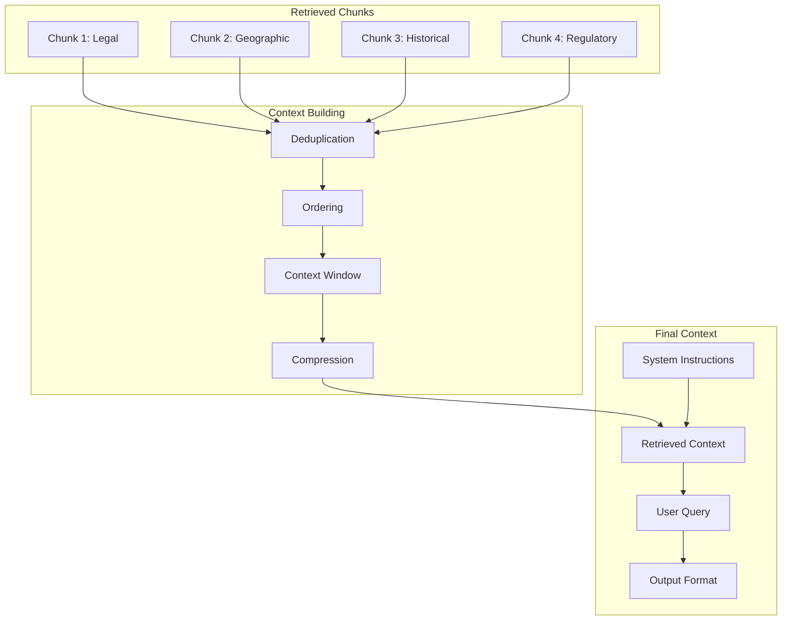

# RAG Design Document

## Document Information

- **Version:** 1.0.0
- **Last Updated:** January 2025
- **Status:** Approved for Implementation
- **Target Sprints:** Sprint 3 (Foundation), Sprint 4-5 (Enhancement), Sprint 6 (Optimization)

## Executive Summary

The Retrieval-Augmented Generation (RAG) system provides OSAE agents with contextual knowledge from property documents, legal frameworks, and historical data. This document defines the architecture, retrieval strategies, and knowledge management approach.

## RAG Architecture Overview



## Knowledge Domains

### Domain Structure

| Domain           | Content Types                         | Update Frequency | Size Estimate | Sprint   |
| ---------------- | ------------------------------------- | ---------------- | ------------- | -------- |
| Legal Compliance | CML Handbook, protocols, legislation  | Monthly          | 50GB          | Sprint 3 |
| Geographic Risk  | OS data, flood maps, subsidence zones | Quarterly        | 100GB         | Sprint 3 |
| Search Templates | Provider formats, requirements        | Weekly           | 5GB           | Sprint 4 |
| Case Precedents  | Legal decisions, rulings              | Monthly          | 20GB          | Sprint 5 |
| Property History | Previous searches, analyses           | Real-time        | Growing       | Sprint 3 |
| Local Knowledge  | Council requirements, peculiarities   | Quarterly        | 10GB          | Sprint 5 |

### Knowledge Base Schema



## Document Processing Pipeline

### Text Extraction

| Document Type  | Extraction Method      | Accuracy Target | Fallback       | Sprint   |
| -------------- | ---------------------- | --------------- | -------------- | -------- |
| PDF (Text)     | PyPDF2/PDFPlumber      | 99%             | OCR            | Sprint 3 |
| PDF (Scanned)  | Tesseract OCR          | 95%             | Manual         | Sprint 3 |
| Word Documents | python-docx            | 99%             | PDF conversion | Sprint 3 |
| Images         | Tesseract/AWS Textract | 90%             | Manual         | Sprint 3 |
| HTML           | BeautifulSoup          | 99%             | Raw text       | Sprint 4 |
| Excel          | openpyxl               | 99%             | CSV export     | Sprint 4 |

### Chunking Strategies

#### Semantic Chunking



#### Chunking Parameters

| Document Type   | Strategy      | Chunk Size  | Overlap    | Metadata Preserved    | Sprint   |
| --------------- | ------------- | ----------- | ---------- | --------------------- | -------- |
| Legal Documents | Hierarchical  | 1024 tokens | 200 tokens | Section, clause, date | Sprint 3 |
| Search Results  | Semantic      | 512 tokens  | 100 tokens | Search type, property | Sprint 4 |
| Geographic Data | Grid-based    | 256 tokens  | 50 tokens  | Coordinates, region   | Sprint 3 |
| Precedents      | Paragraph     | 768 tokens  | 150 tokens | Case ref, court, date | Sprint 5 |
| Regulations     | Section-based | 1024 tokens | 200 tokens | Regulation, section   | Sprint 3 |

## Embedding Generation

### Embedding Models

| Model                  | Provider | Dimensions | Speed     | Quality   | Use Case        | Sprint   |
| ---------------------- | -------- | ---------- | --------- | --------- | --------------- | -------- |
| text-embedding-3-small | OpenAI   | 1536       | Fast      | Good      | General purpose | Sprint 3 |
| text-embedding-3-large | OpenAI   | 3072       | Medium    | Excellent | High precision  | Sprint 5 |
| all-MiniLM-L6-v2       | Local    | 384        | Very Fast | Fair      | Caching/testing | Sprint 3 |
| Legal-BERT             | Custom   | 768        | Slow      | Excellent | Legal documents | Sprint 5 |
| Titan Embeddings       | AWS      | 1024       | Fast      | Good      | AWS native      | Sprint 3 |

### Embedding Pipeline



## Retrieval Strategies

### Multi-Stage Retrieval



### Retrieval Methods

#### Similarity Search

| Method             | Description           | Pros                | Cons                    | Use Case         | Sprint   |
| ------------------ | --------------------- | ------------------- | ----------------------- | ---------------- | -------- |
| Cosine Similarity  | Angle between vectors | Fast, intuitive     | Ignores magnitude       | Default search   | Sprint 3 |
| Euclidean Distance | Geometric distance    | Considers magnitude | Sensitive to dimensions | Precise matching | Sprint 4 |
| Dot Product        | Vector multiplication | Very fast           | Requires normalization  | High volume      | Sprint 3 |
| HNSW               | Hierarchical graph    | Scalable            | Complex setup           | Large scale      | Sprint 5 |

#### Hybrid Search



### Re-ranking Strategies

#### Re-ranking Pipeline

| Stage        | Method             | Input   | Output     | Purpose      | Sprint   |
| ------------ | ------------------ | ------- | ---------- | ------------ | -------- |
| Initial      | Vector similarity  | Query   | Top 100    | Broad recall | Sprint 3 |
| Filter       | Metadata matching  | Top 100 | Top 50     | Relevance    | Sprint 3 |
| Cross-encode | BERT cross-encoder | Top 50  | Top 20     | Precision    | Sprint 5 |
| Diversity    | MMR algorithm      | Top 20  | Top 10     | Variety      | Sprint 4 |
| Business     | Custom rules       | Top 10  | Final 5-10 | Priority     | Sprint 4 |

## Context Management

### Context Assembly



### Context Window Management

| Model           | Max Tokens | Reserved System | Available Context | Strategy     | Sprint   |
| --------------- | ---------- | --------------- | ----------------- | ------------ | -------- |
| Claude 3 Sonnet | 200k       | 2k              | 198k              | Full context | Sprint 3 |
| GPT-4 Turbo     | 128k       | 2k              | 126k              | Full context | Sprint 3 |
| Claude 3 Haiku  | 200k       | 1k              | 199k              | Summarized   | Sprint 3 |
| Llama 3 70B     | 8k         | 1k              | 7k                | Compressed   | Sprint 5 |

## Quality Assurance

### Retrieval Quality Metrics

```mermaid
graph LR
    subgraph "Relevance Metrics"
        PRECISION[Precision@k]
        RECALL[Recall@k]
        F1[F1 Score]
    end

    subgraph "Ranking Metrics"
        MRR[Mean Reciprocal Rank]
        NDCG[Normalized DCG]
        MAP[Mean Average Precision]
    end

    subgraph "User Metrics"
        CLICK[Click-through Rate]
        DWELL[Dwell Time]
        FEEDBACK[User Feedback]
    end

    PRECISION --> EVAL[Evaluation Score]
    RECALL --> EVAL
    F1 --> EVAL
    MRR --> EVAL
    NDCG --> EVAL
    MAP --> EVAL
    CLICK --> EVAL
    DWELL --> EVAL
    FEEDBACK --> EVAL
```

### Quality Targets

| Metric            | Target | Minimum | Alert Threshold | Sprint   |
| ----------------- | ------ | ------- | --------------- | -------- |
| Precision@10      | 80%    | 70%     | <70%            | Sprint 3 |
| Recall@10         | 75%    | 65%     | <65%            | Sprint 3 |
| MRR               | 0.8    | 0.7     | <0.7            | Sprint 4 |
| User Satisfaction | 4.5/5  | 4.0/5   | <4.0            | Sprint 5 |
| Response Time     | <2s    | <5s     | >5s             | Sprint 3 |
| Cache Hit Rate    | 60%    | 40%     | <40%            | Sprint 4 |

## Optimization Strategies

### Performance Optimization

| Technique          | Description            | Impact                | Implementation   | Sprint   |
| ------------------ | ---------------------- | --------------------- | ---------------- | -------- |
| Embedding Cache    | Cache frequent queries | 50% faster            | Redis/DynamoDB   | Sprint 3 |
| Index Optimization | HNSW/IVF indices       | 10x faster search     | Vector DB config | Sprint 4 |
| Batch Processing   | Batch embed requests   | 30% cost reduction    | Queue system     | Sprint 3 |
| Compression        | Quantize embeddings    | 75% storage reduction | Post-processing  | Sprint 5 |
| Sharding           | Distribute by domain   | Linear scaling        | Multi-index      | Sprint 6 |

### Cost Optimization

[Mermaid for Cost Optimization here]

## Maintenance & Updates

### Knowledge Base Updates

| Update Type      | Frequency | Process            | Validation        | Sprint   |
| ---------------- | --------- | ------------------ | ----------------- | -------- |
| Legal Documents  | Monthly   | Automated scraping | Legal review      | Sprint 3 |
| Geographic Data  | Quarterly | Bulk upload        | Automated tests   | Sprint 3 |
| Search Templates | Weekly    | API sync           | Schema validation | Sprint 4 |
| Case Law         | Monthly   | Manual curation    | Solicitor review  | Sprint 5 |
| Local Knowledge  | As needed | Community input    | Verification      | Sprint 5 |

### Version Control

[Mermaid for Version Control here]

## Security & Privacy

### Data Security

| Aspect                | Requirement    | Implementation       | Validation       | Sprint   |
| --------------------- | -------------- | -------------------- | ---------------- | -------- |
| Encryption at Rest    | AES-256        | Native DB encryption | Security scan    | Sprint 3 |
| Encryption in Transit | TLS 1.3        | HTTPS everywhere     | SSL tests        | Sprint 3 |
| Access Control        | RBAC           | IAM policies         | Audit logs       | Sprint 3 |
| Data Isolation        | Multi-tenant   | Namespace separation | Penetration test | Sprint 4 |
| PII Handling          | GDPR compliant | Anonymization        | Privacy audit    | Sprint 3 |

### Privacy Controls

[Mermaid for Privacy Controls here]

## Monitoring & Analytics

### RAG Metrics Dashboard

| Panel       | Metrics                     | Update Frequency | Alert Rules    | Sprint   |
| ----------- | --------------------------- | ---------------- | -------------- | -------- |
| Performance | Latency, throughput         | Real-time        | >5s latency    | Sprint 3 |
| Quality     | Precision, recall, MRR      | Hourly           | <70% precision | Sprint 3 |
| Usage       | Queries/hour, cache hits    | Real-time        | >1000 qph      | Sprint 3 |
| Cost        | API calls, storage          | Daily            | >£100/day      | Sprint 4 |
| Errors      | Failed retrievals, timeouts | Real-time        | >5% error rate | Sprint 3 |

### Analytics Pipeline

[Mermaid for Analytics Pipeline here]

## Appendix: Configuration Examples

### Vector Store Configuration

| Parameter       | Development | Staging | Production | Notes                   |
| --------------- | ----------- | ------- | ---------- | ----------------------- |
| Index Type      | Flat        | IVF     | HNSW       | Performance vs accuracy |
| Number of Lists | -           | 100     | 1000       | For IVF index           |
| ef_construction | -           | -       | 200        | For HNSW index          |
| ef_search       | -           | -       | 100        | For HNSW index          |
| Metric          | Cosine      | Cosine  | Cosine     | Similarity metric       |
| Dimensions      | 384         | 1536    | 1536       | Embedding size          |

### Retrieval Configuration

| Parameter            | Value | Range   | Description        |
| -------------------- | ----- | ------- | ------------------ |
| top_k_initial        | 100   | 50-200  | Initial retrieval  |
| top_k_rerank         | 20    | 10-50   | After reranking    |
| top_k_final          | 10    | 5-15    | Final context      |
| similarity_threshold | 0.7   | 0.6-0.9 | Minimum similarity |
| diversity_threshold  | 0.3   | 0.2-0.5 | MMR diversity      |
| metadata_boost       | 1.2   | 1.0-2.0 | Metadata weight    |
