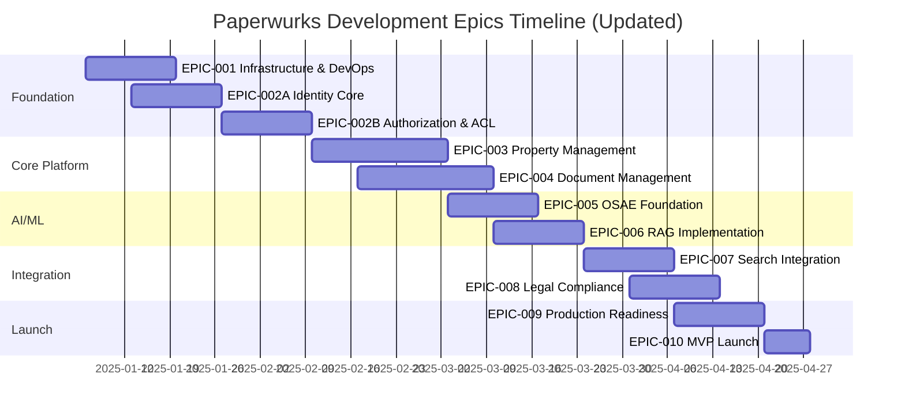

# Paperwurks Sprint Plan & Epics - UPDATED

## Project Overview

Building a property due diligence platform that automates document collection, AI-powered analysis, and search orchestration for UK property transactions.

## Project Timeline

- **Duration:** 14 weeks (3.5 months) for MVP
- **Methodology:** Agile with 2-week sprints
- **Team Size:** 2-3 developers
- **Start Date:** January 2025
- **MVP Launch:** April 2025

## Epic Overview - UPDATED

## Epic Definitions

### EPIC-001: Infrastructure & DevOps Foundation

**Priority:** P0 - Critical  
**Sprint:** Sprint 0 (Week 1-2)  
**Team:** DevOps Lead + Backend Dev  
**Dependencies:** None

#### Description

Establish the complete cloud infrastructure, CI/CD pipelines, and development environment for Paperwurks platform.

#### Success Criteria

- AWS infrastructure provisioned and secured
- Development, staging, and production environments operational
- CI/CD pipeline deploying automatically
- Monitoring and alerting configured
- Team can develop and deploy code

#### User Stories

| ID     | Story                                                                             | Points | Priority |
| ------ | --------------------------------------------------------------------------------- | ------ | -------- |
| US-001 | As a developer, I need AWS infrastructure so I can deploy applications            | 8      | P0       |
| US-002 | As a developer, I need CI/CD pipeline so deployments are automated                | 5      | P0       |
| US-003 | As a DevOps engineer, I need monitoring so I can track system health              | 5      | P0       |
| US-004 | As a developer, I need local development environment so I can develop efficiently | 3      | P0       |
| US-005 | As a CTO, I need infrastructure documentation so team understands architecture    | 3      | P1       |

---

### EPIC-002A: Identity Core & Authentication

**Priority:** P0 - Critical  
**Sprint:** Sprint 1A (Week 3-4)  
**Team:** Backend Dev + Backend Lead  
**Dependencies:** EPIC-001

#### Description

Implement the foundational Identity and Entity models with core authentication capabilities. This establishes the IAM system that all other services will depend on.

#### Architectural Components

- **Identity Model**: Core principal (person or service account)
- **Entity Model**: Tenancy and access boundary scoping
- **Authentication**: JWT-based login, registration, password management
- **Profile Model**: Domain-specific metadata storage
- **Audit Integration**: Authentication event logging

#### Success Criteria

- Identity and Entity models operational
- Users can register and login securely
- JWT authentication with refresh tokens working
- Entity-based tenancy scoping enforced
- Profile data storage functional
- Password reset flow operational
- All authentication events logged for audit
- Service layer exposes IdentityService API

#### User Stories

| ID      | Story                                                                                 | Points | Priority | Module   |
| ------- | ------------------------------------------------------------------------------------- | ------ | -------- | -------- |
| US-006  | As a user, I need to register an account so I can access the platform                 | 5      | P0       | Identity |
| US-007  | As a user, I need to login securely so my data is protected                           | 5      | P0       | Identity |
| US-008  | As a system, I need JWT token management so sessions are secure and stateless         | 5      | P0       | Identity |
| US-009  | As a user, I need to reset my password so I can recover account access                | 3      | P0       | Identity |
| US-010A | As a user, I need to verify my email so my account is authenticated                   | 3      | P0       | Identity |
| US-011  | As a system, I need Entity model so I can scope multi-tenancy boundaries              | 5      | P0       | Entity   |
| US-012  | As an admin, I need to manage Entities so I can control organizational access         | 3      | P1       | Entity   |
| US-013  | As a user, I need Profile storage so my domain-specific data is maintained            | 3      | P1       | Profile  |
| US-014  | As a compliance officer, I need audit logs for auth events so I can track user access | 3      | P0       | Identity |

**Total Points:** 35 (requires 4 developers or extended sprint)

#### Technical Specifications

**Identity Model Fields:**

- id (UUID), email, password_hash, first_name, last_name
- entity_id (FK), is_active, is_verified, mfa_enabled
- last_login, created_at, updated_at

**Entity Model Fields:**

- id (UUID), name, entity_type, settings (JSONField)
- is_active, created_at, updated_at

**Profile Model Fields:**

- id (UUID), identity_id (OneToOne), metadata (JSONField)
- solicitor_credentials, preferences, created_at, updated_at

---

### EPIC-002B: Authorization & Access Control

**Priority:** P0 - Critical  
**Sprint:** Sprint 1B (Week 5-6)  
**Team:** Backend Lead + Backend Dev  
**Dependencies:** EPIC-002A

#### Description

Implement Role-Based Access Control (RBAC) and Access Control Lists (ACL) for fine-grained permission management. Includes permission middleware and integration points for other services.

#### Architectural Components

- **Role Model**: RBAC baseline permissions
- **Permission System**: Codename-based permission definitions
- **ACL Model**: Resource-level permission overrides
- **Permission Middleware**: Server-side permission enforcement
- **Service Integration**: IAM API for other apps

#### Success Criteria

- Role model with permission assignments operational
- RBAC enforced across all endpoints
- ACL model for fine-grained permissions functional
- Permission grants can be created, updated, and revoked
- ACL grants support expiration
- Permission middleware enforces checks on all protected resources
- AuditService logs all GRANT/REVOKE actions
- IdentityService exposes permission checking API
- Integration with Property, Pack, Document services working

#### User Stories

| ID     | Story                                                                                    | Points | Priority | Module      |
| ------ | ---------------------------------------------------------------------------------------- | ------ | -------- | ----------- |
| US-015 | As an admin, I need Role model so I can assign baseline permissions to users             | 5      | P0       | Role        |
| US-016 | As a system, I need Permission definitions so I can control resource access              | 5      | P0       | Role        |
| US-017 | As an admin, I need to assign Roles to Identities so users have appropriate access       | 3      | P0       | Role        |
| US-018 | As a system, I need ACL model so I can grant resource-specific permissions               | 8      | P0       | ACL         |
| US-019 | As an admin, I need to create ACL grants so specific users can access specific resources | 5      | P0       | ACL         |
| US-020 | As a system, I need ACL expiration so temporary access can be granted                    | 3      | P1       | ACL         |
| US-021 | As a developer, I need permission middleware so all endpoints enforce access control     | 8      | P0       | Middleware  |
| US-022 | As a system, I need to audit permission changes so all grants/revokes are tracked        | 3      | P0       | ACL         |
| US-023 | As a developer, I need IdentityService API so other apps can check permissions           | 5      | P0       | Service     |
| US-024 | As a system, I need identity integration with PropertyService for access control         | 3      | P1       | Integration |
| US-025 | As a system, I need identity integration with PackService for access control             | 3      | P1       | Integration |

**Total Points:** 51 (requires prioritization or extended sprint)

#### Recommended Sprint 1B Split (28 points for 2-week sprint):

**Must Have (28 points):**

- US-015, US-016, US-017 (Role & Permissions) - 13 points
- US-018, US-019, US-022 (ACL Core) - 16 points
- US-021 (Middleware) - 8 points (moved to Sprint 2)
- US-023 (Service API) - 5 points (moved to Sprint 2)

**Deferred to Sprint 2:**

- US-020 (ACL Expiration) - 3 points
- US-021 (Middleware implementation across all endpoints)
- US-023 (IdentityService API completion)
- US-024, US-025 (Integration stories)

#### Technical Specifications

**Role Model Fields:**

- id (UUID), name, codename, description
- permissions (ManyToMany → Permission), created_at, updated_at

**Permission Model Fields:**

- id (UUID), codename, name, description
- resource_type, action, created_at

**ACL Model Fields:**

- id (UUID), identity_id (FK), resource_type, resource_id
- permission (FK), granted_by (FK), granted_at
- expires_at, revoked_at, revoked_by (FK)

**Permission Codename Format:**

- `{resource}.{action}` (e.g., `property.view`, `pack.signoff`, `document.upload`)

---

### EPIC-003: Property Management System

**Priority:** P0 - Critical  
**Sprint:** Sprint 2-3 (Week 7-9)  
**Team:** Full Team  
**Dependencies:** EPIC-002A, EPIC-002B

#### Description

Create comprehensive property management system allowing agents to create properties, manage listings, and track transaction progress.

#### Success Criteria

- Agents can create and manage properties
- UPRN integration functioning
- Property assignment workflow operational
- Status tracking and transitions working
- Dashboard showing all property metrics
- Permission enforcement via IdentityService

#### User Stories

| ID     | Story                                                                       | Points | Priority |
| ------ | --------------------------------------------------------------------------- | ------ | -------- |
| US-026 | As an agent, I need to create property listings so I can start transactions | 8      | P0       |
| US-027 | As an agent, I need to search properties by postcode so I can find listings | 5      | P0       |
| US-028 | As an agent, I need to assign solicitors to properties so they can review   | 5      | P0       |
| US-029 | As an agent, I need to track property status so I know transaction progress | 5      | P1       |
| US-030 | As an agent, I need property dashboard so I can manage portfolio            | 8      | P1       |
| US-031 | As a system, I need UPRN validation so property data is accurate            | 5      | P1       |

---

### EPIC-004: Document Management System

**Priority:** P0 - Critical  
**Sprint:** Sprint 3-4 (Week 8-10)  
**Team:** Backend Dev + Frontend Dev  
**Dependencies:** EPIC-003

#### Description

Implement secure document upload, storage, and management system with S3 integration and document versioning.

#### Success Criteria

- Document upload to S3 working
- Versioning and metadata tracked
- Permission-based access enforced
- Document types validated
- AI processing queue triggered

#### User Stories

| ID     | Story                                                                            | Points | Priority |
| ------ | -------------------------------------------------------------------------------- | ------ | -------- |
| US-032 | As an agent, I need to upload documents so I can build property packs            | 8      | P0       |
| US-033 | As a system, I need S3 integration so documents are stored securely              | 8      | P0       |
| US-034 | As a system, I need document versioning so changes are tracked                   | 5      | P0       |
| US-035 | As a solicitor, I need to view documents so I can review property information    | 3      | P0       |
| US-036 | As a system, I need document type validation so only valid files are accepted    | 3      | P1       |
| US-037 | As a system, I need to trigger AI processing on upload so documents are analyzed | 5      | P1       |

---

## Sprint Breakdown

### Sprint 0: Foundation Setup (Week 1-2)

**Goal:** Infrastructure and development environment ready  
**Epic:** EPIC-001  
**Capacity:** 2 developers × 10 days = 20 points

#### Committed Stories

| Story ID  | Points | Assignee    | Status      |
| --------- | ------ | ----------- | ----------- |
| US-001    | 8      | DevOps Lead | Completed   |
| US-002    | 5      | DevOps Lead | Completed   |
| US-004    | 3      | Backend Dev | Completed   |
| US-003    | 5      | DevOps Lead | In Progress |
| **Total** | **21** |             |             |

#### Sprint Goals

- ✅ AWS infrastructure operational
- ✅ CI/CD pipeline deploying to dev
- ✅ Local development environment documented
- 🔄 Monitoring and alerting setup

---

### Sprint 1A: Identity Core & Authentication (Week 3-4)

**Goal:** Foundational Identity and Entity models with authentication  
**Epic:** EPIC-002A  
**Capacity:** 3 developers × 10 days = 30 points  
**Start Date:** October 16, 2025

#### Committed Stories

| Story ID  | Points | Assignee     | Status      | Module   |
| --------- | ------ | ------------ | ----------- | -------- |
| US-006    | 5      | Backend Dev  | Not Started | Identity |
| US-007    | 5      | Backend Dev  | Not Started | Identity |
| US-008    | 5      | Backend Lead | Not Started | Identity |
| US-009    | 3      | Backend Dev  | Not Started | Identity |
| US-010A   | 3      | Backend Dev  | Not Started | Identity |
| US-011    | 5      | Backend Lead | Not Started | Entity   |
| US-012    | 3      | Backend Dev  | Not Started | Entity   |
| US-013    | 3      | Backend Dev  | Not Started | Profile  |
| US-014    | 3      | Backend Lead | Not Started | Audit    |
| **Total** | **35** |              |             |          |

#### Sprint Goals

- Identity and Entity models created and tested
- User registration and login working
- JWT authentication implemented
- Email verification flow functional
- Profile storage operational
- Audit logging for auth events

#### Notes

**Capacity Adjustment:** This sprint has 35 points for a 30-point capacity. Options:

1. Extend sprint by 2 days
2. Defer US-012 (Entity management UI) to Sprint 1B
3. Defer US-013 (Profile storage) to Sprint 1B
4. Add temporary 4th developer

**Recommended:** Defer US-012 and US-013 to Sprint 1B (reduces to 29 points)

---

### Sprint 1B: Authorization & Access Control (Week 5-6)

**Goal:** RBAC and ACL system with permission enforcement  
**Epic:** EPIC-002B  
**Capacity:** 3 developers × 10 days = 30 points

#### Committed Stories

| Story ID  | Points | Assignee     | Status      | Module             |
| --------- | ------ | ------------ | ----------- | ------------------ |
| US-015    | 5      | Backend Lead | Not Started | Role               |
| US-016    | 5      | Backend Lead | Not Started | Role               |
| US-017    | 3      | Backend Dev  | Not Started | Role               |
| US-018    | 8      | Backend Lead | Not Started | ACL                |
| US-019    | 5      | Backend Dev  | Not Started | ACL                |
| US-022    | 3      | Backend Dev  | Not Started | ACL                |
| US-012    | 3      | Backend Dev  | Not Started | Entity (deferred)  |
| US-013    | 3      | Backend Dev  | Not Started | Profile (deferred) |
| **Total** | **35** |              |             |                    |

#### Deferred to Sprint 2

| Story ID | Points | Module      | Reason                        |
| -------- | ------ | ----------- | ----------------------------- |
| US-020   | 3      | ACL         | Non-critical feature          |
| US-021   | 8      | Middleware  | Needs integration testing     |
| US-023   | 5      | Service     | Needs Role/ACL to be complete |
| US-024   | 3      | Integration | Property app not yet ready    |
| US-025   | 3      | Integration | Pack app not yet ready        |

#### Sprint Goals

- Role and Permission models operational
- RBAC assignment working
- ACL model with grant/revoke functional
- Permission audit logging complete
- Entity management completed (from 1A)
- Profile storage completed (from 1A)

---

### Sprint 2: Property Management Start + Identity Integration (Week 7-8)

**Goal:** Begin property management with full identity integration  
**Epic:** EPIC-003 + EPIC-002B completion  
**Capacity:** 3 developers × 10 days = 30 points

#### Committed Stories

| Story ID  | Points | Assignee     | Epic      |
| --------- | ------ | ------------ | --------- |
| US-021    | 8      | Backend Lead | EPIC-002B |
| US-023    | 5      | Backend Lead | EPIC-002B |
| US-020    | 3      | Backend Dev  | EPIC-002B |
| US-026    | 8      | Backend Dev  | EPIC-003  |
| US-027    | 5      | Backend Dev  | EPIC-003  |
| **Total** | **29** |              |           |

#### Sprint Goals

- Permission middleware fully implemented
- IdentityService API exposed to other apps
- ACL expiration feature complete
- Property creation with permission checks working
- Property search functional

---

### Sprint 3: Property Management Complete (Week 9-10)

**Goal:** Complete property management features  
**Epic:** EPIC-003  
**Capacity:** 3 developers × 10 days = 30 points

#### Committed Stories

| Story ID  | Points | Assignee     |
| --------- | ------ | ------------ |
| US-024    | 3      | Backend Dev  |
| US-025    | 3      | Backend Dev  |
| US-028    | 5      | Backend Dev  |
| US-029    | 5      | Backend Dev  |
| US-030    | 8      | Frontend Dev |
| US-031    | 5      | Backend Dev  |
| **Total** | **29** |              |

---

## 📊 Updated Timeline Impact

### Original Timeline

- 12 weeks (6 sprints)
- EPIC-002: 1 sprint (2 weeks)

### Updated Timeline

- 14 weeks (7 sprints)
- EPIC-002A: 1 sprint (2 weeks)
- EPIC-002B: 1 sprint (2 weeks)
- Integration: Carried into Sprint 2

### Rationale for Change

1. **Identity is foundational** - All other apps depend on it
2. **Complexity underestimated** - 6 models (Identity, Entity, Role, Permission, ACL, Profile) + middleware + service layer
3. **Integration critical** - Property, Pack, Document, Feedback all need permission checks
4. **Audit requirements** - Every permission change must be logged
5. **TDD approach** - Comprehensive testing adds development time

### Risk Mitigation

- **Risk:** Timeline extended by 2 weeks
- **Mitigation:** Identity completion enables parallel development in later sprints
- **Benefit:** Solid IAM foundation prevents rework and security issues

---

## Success Metrics

### Sprint 1A Success Criteria

- [ ] Identity model tests passing (>90% coverage)
- [ ] Entity model tests passing (>90% coverage)
- [ ] User can register and login via API
- [ ] JWT tokens issued and validated
- [ ] Email verification functional
- [ ] Password reset flow working
- [ ] Profile data storage operational
- [ ] Authentication audit logs created

### Sprint 1B Success Criteria

- [ ] Role model tests passing (>90% coverage)
- [ ] ACL model tests passing (>90% coverage)
- [ ] Roles can be assigned to identities
- [ ] ACL grants can be created and revoked
- [ ] Permission checks enforce access control
- [ ] All GRANT/REVOKE actions audited
- [ ] Service layer API documented
- [ ] Integration tests with audit service passing

---

## Next Steps

1. **Immediate:** Review and approve updated sprint plan
2. **Week 3:** Begin Sprint 1A (Identity Core)
3. **Week 5:** Begin Sprint 1B (Authorization)
4. **Week 7:** Begin Sprint 2 (Property + Identity Integration)
5. **Post-Sprint 2:** Review integration points and adjust remaining epics if needed

---

## Notes for Development Team

### Sprint 1A Focus

- Start with Identity and Entity models (most critical)
- Authentication flows are well-understood (lower risk)
- Profile can be implemented last in sprint

### Sprint 1B Focus

- Role/Permission system is complex (allocate extra time)
- ACL model requires careful design (many edge cases)
- Middleware must be thoroughly tested (affects all endpoints)
- Service API design is critical for other teams

### Technical Debt Prevention

- Document all permission codenames as they're created
- Write integration tests for permission checks
- Create permission checking utilities/decorators
- Maintain audit log integrity
