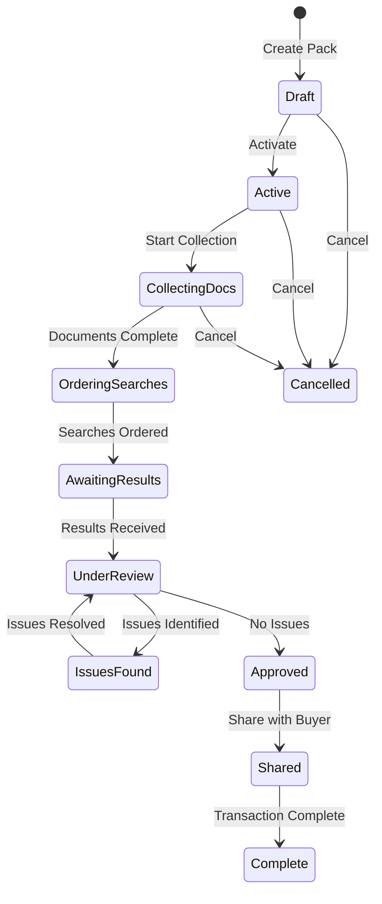
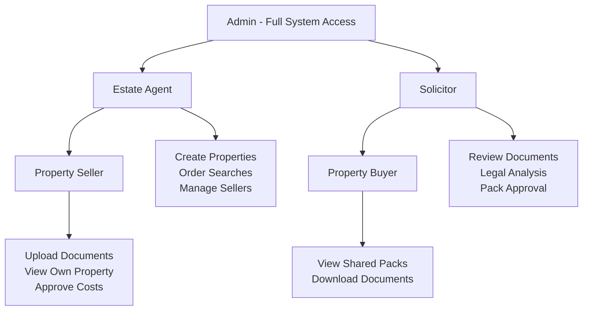
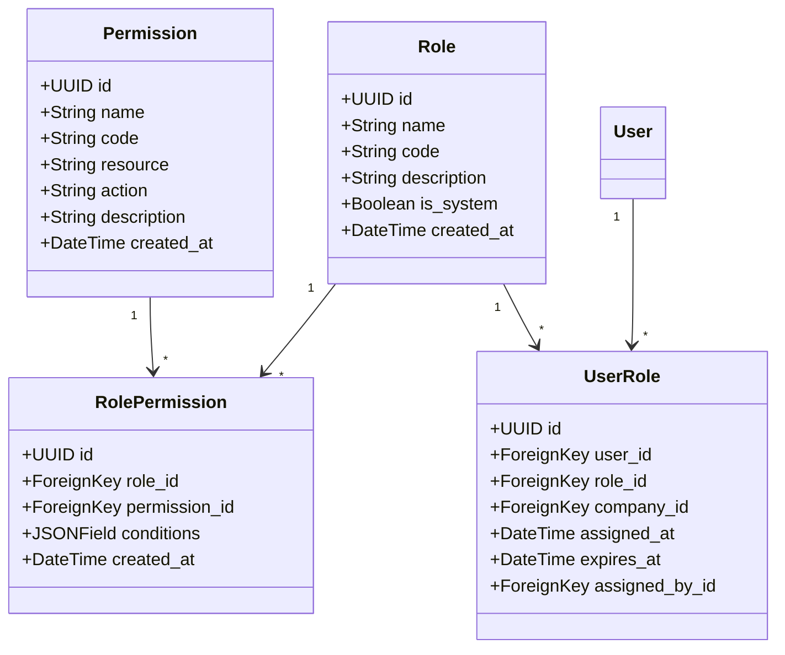
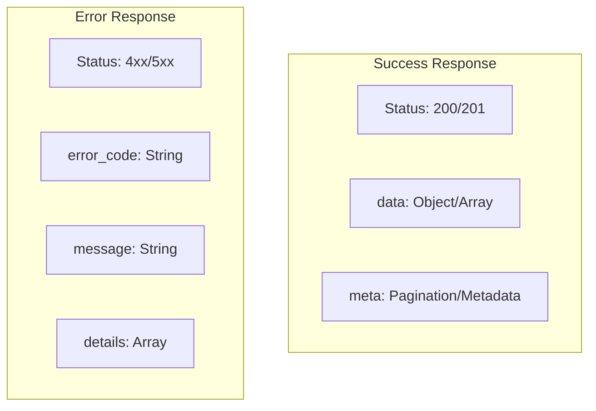
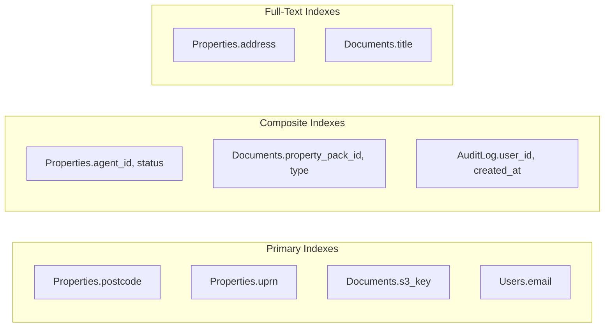

# Application Design Document

## Document Information

- **Version:** 1.0.0
- **Last Updated:** January 2025
- **Status:** Approved for Implementation
- **Target Sprints:** Sprint 1-2 (Core Models), Sprint 1 (RBAC), Sprint 2-6 (Features)

## Executive Summary

This document defines the Django backend architecture for Paperwurks, including domain models, role-based access control (RBAC), and compliance audit system. The design follows Domain-Driven Design principles with clear bounded contexts.

## Domain Model Architecture

### Bounded Contexts

[Domain Model Architecture mermaid]

## Core Domain Models

### User & Identity Models

#### User Model

| Field         | Type          | Constraints       | Description          | Sprint   |
| ------------- | ------------- | ----------------- | -------------------- | -------- |
| id            | UUID          | Primary Key       | Unique identifier    | Sprint 1 |
| email         | EmailField    | Unique, Required  | Login credential     | Sprint 1 |
| password_hash | CharField     | Required          | Bcrypt hashed        | Sprint 1 |
| role          | CharField     | Required, Choices | User role enum       | Sprint 1 |
| first_name    | CharField     | Required          | User's first name    | Sprint 1 |
| last_name     | CharField     | Required          | User's last name     | Sprint 1 |
| company_id    | ForeignKey    | Optional          | Company association  | Sprint 1 |
| phone         | CharField     | Optional          | Contact number       | Sprint 1 |
| is_active     | BooleanField  | Default=True      | Account status       | Sprint 1 |
| is_verified   | BooleanField  | Default=False     | Email verification   | Sprint 1 |
| mfa_enabled   | BooleanField  | Default=False     | 2FA status           | Sprint 2 |
| last_login    | DateTimeField | Auto-updated      | Last login timestamp | Sprint 1 |
| created_at    | DateTimeField | Auto-created      | Registration date    | Sprint 1 |
| updated_at    | DateTimeField | Auto-updated      | Last modification    | Sprint 1 |

#### Company Model

| Field               | Type          | Constraints       | Description          | Sprint   |
| ------------------- | ------------- | ----------------- | -------------------- | -------- |
| id                  | UUID          | Primary Key       | Unique identifier    | Sprint 1 |
| name                | CharField     | Required, Unique  | Company name         | Sprint 1 |
| registration_number | CharField     | Optional          | Companies House #    | Sprint 1 |
| type                | CharField     | Required, Choices | Agent/Solicitor firm | Sprint 1 |
| address             | TextField     | Required          | Registered address   | Sprint 1 |
| postcode            | CharField     | Required          | UK postcode          | Sprint 1 |
| subscription_tier   | CharField     | Required          | Billing tier         | Sprint 2 |
| is_active           | BooleanField  | Default=True      | Account status       | Sprint 1 |
| created_at          | DateTimeField | Auto-created      | Registration date    | Sprint 1 |

#### Property Model

| Field            | Type          | Constraints            | Description           | Sprint   |
| ---------------- | ------------- | ---------------------- | --------------------- | -------- |
| id               | UUID          | Primary Key            | Unique identifier     | Sprint 2 |
| reference        | CharField     | Unique, Auto-generated | PAP-YYYYMMDD-XXXX     | Sprint 2 |
| address_line_1   | CharField     | Required               | First line of address | Sprint 2 |
| address_line_2   | CharField     | Optional               | Second line           | Sprint 2 |
| town_city        | CharField     | Required               | Town or city          | Sprint 2 |
| county           | CharField     | Optional               | County                | Sprint 2 |
| postcode         | CharField     | Required, Indexed      | UK postcode           | Sprint 2 |
| uprn             | CharField     | Optional, Indexed      | Unique property ref   | Sprint 2 |
| coordinates      | PointField    | Optional               | Lat/Long              | Sprint 2 |
| property_type    | CharField     | Required, Choices      | House/Flat/etc        | Sprint 2 |
| tenure           | CharField     | Required, Choices      | Freehold/Leasehold    | Sprint 2 |
| bedrooms         | IntegerField  | Optional               | Number of bedrooms    | Sprint 2 |
| estimated_value  | DecimalField  | Optional               | Property value        | Sprint 2 |
| epc_rating       | CharField     | Optional               | Energy rating         | Sprint 2 |
| council_tax_band | CharField     | Optional               | Tax band              | Sprint 2 |
| agent_id         | ForeignKey    | Required               | Estate agent          | Sprint 2 |
| seller_id        | ForeignKey    | Required               | Property owner        | Sprint 2 |
| solicitor_id     | ForeignKey    | Optional               | Assigned solicitor    | Sprint 2 |
| created_at       | DateTimeField | Auto-created           | Creation date         | Sprint 2 |
| updated_at       | DateTimeField | Auto-updated           | Last modification     | Sprint 2 |

#### PropertyPack Model

| Field                 | Type          | Constraints       | Description              | Sprint   |
| --------------------- | ------------- | ----------------- | ------------------------ | -------- |
| id                    | UUID          | Primary Key       | Unique identifier        | Sprint 2 |
| property_id           | ForeignKey    | Required, Cascade | Associated property      | Sprint 2 |
| pack_type             | CharField     | Required, Choices | Sale/Purchase/Remortgage | Sprint 2 |
| status                | CharField     | Required, Choices | Pack status enum         | Sprint 2 |
| completion_percentage | DecimalField  | Default=0         | Progress tracker         | Sprint 2 |
| risk_level            | CharField     | Optional, Choices | Low/Medium/High          | Sprint 3 |
| risk_factors          | JSONField     | Default=[]        | Identified risks         | Sprint 3 |
| estimated_cost        | DecimalField  | Optional          | Total search costs       | Sprint 3 |
| actual_cost           | DecimalField  | Optional          | Final costs              | Sprint 4 |
| buyer_id              | ForeignKey    | Optional          | Interested buyer         | Sprint 5 |
| chain_position        | IntegerField  | Optional          | Position in chain        | Sprint 5 |
| target_exchange_date  | DateField     | Optional          | Target date              | Sprint 2 |
| actual_exchange_date  | DateField     | Optional          | Actual date              | Sprint 6 |
| created_at            | DateTimeField | Auto-created      | Pack creation            | Sprint 2 |
| completed_at          | DateTimeField | Optional          | Completion date          | Sprint 6 |

### Document Domain Models

#### Document Model

| Field            | Type            | Constraints       | Description       | Sprint   |
| ---------------- | --------------- | ----------------- | ----------------- | -------- |
| id               | UUID            | Primary Key       | Unique identifier | Sprint 2 |
| property_pack_id | ForeignKey      | Required, Cascade | Associated pack   | Sprint 2 |
| document_type    | CharField       | Required, Choices | Document category | Sprint 2 |
| document_subtype | CharField       | Optional          | Specific type     | Sprint 2 |
| title            | CharField       | Required          | Display name      | Sprint 2 |
| file_name        | CharField       | Required          | Original filename | Sprint 2 |
| file_extension   | CharField       | Required          | File type         | Sprint 2 |
| mime_type        | CharField       | Required          | MIME type         | Sprint 2 |
| file_size        | BigIntegerField | Required          | Size in bytes     | Sprint 2 |
| s3_key           | CharField       | Required, Unique  | S3 object key     | Sprint 2 |
| s3_version_id    | CharField       | Optional          | S3 version        | Sprint 2 |
| checksum         | CharField       | Required          | SHA-256 hash      | Sprint 2 |
| uploaded_by_id   | ForeignKey      | Required          | Uploader          | Sprint 2 |
| is_required      | BooleanField    | Default=False     | Required document | Sprint 2 |
| is_valid         | BooleanField    | Default=True      | Validity status   | Sprint 2 |
| expires_at       | DateField       | Optional          | Expiry date       | Sprint 4 |
| metadata         | JSONField       | Default={}        | Additional data   | Sprint 2 |
| created_at       | DateTimeField   | Auto-created      | Upload date       | Sprint 2 |
| updated_at       | DateTimeField   | Auto-updated      | Last modification | Sprint 2 |

#### DocumentAnalysis Model

| Field              | Type          | Constraints       | Description         | Sprint   |
| ------------------ | ------------- | ----------------- | ------------------- | -------- |
| id                 | UUID          | Primary Key       | Unique identifier   | Sprint 3 |
| document_id        | OneToOneField | Required, Cascade | Analyzed document   | Sprint 3 |
| analysis_type      | CharField     | Required, Choices | AI/Manual/Hybrid    | Sprint 3 |
| status             | CharField     | Required, Choices | Analysis status     | Sprint 3 |
| ai_provider        | CharField     | Optional          | AI service used     | Sprint 3 |
| ai_model           | CharField     | Optional          | Model version       | Sprint 3 |
| risk_flags         | JSONField     | Default=[]        | Identified risks    | Sprint 3 |
| key_dates          | JSONField     | Default=[]        | Important dates     | Sprint 3 |
| entities           | JSONField     | Default=[]        | Extracted entities  | Sprint 3 |
| summary            | TextField     | Optional          | Document summary    | Sprint 3 |
| confidence_score   | DecimalField  | Optional          | AI confidence       | Sprint 3 |
| solicitor_notes    | TextField     | Optional          | Manual review notes | Sprint 5 |
| solicitor_override | JSONField     | Default={}        | Manual corrections  | Sprint 5 |
| requires_action    | BooleanField  | Default=False     | Action needed       | Sprint 3 |
| action_items       | JSONField     | Default=[]        | Required actions    | Sprint 3 |
| analyzed_at        | DateTimeField | Optional          | Analysis timestamp  | Sprint 3 |
| reviewed_at        | DateTimeField | Optional          | Review timestamp    | Sprint 5 |
| reviewed_by_id     | ForeignKey    | Optional          | Reviewing solicitor | Sprint 5 |

### Search Domain Models

#### Search Model

| Field              | Type          | Constraints       | Description       | Sprint   |
| ------------------ | ------------- | ----------------- | ----------------- | -------- |
| id                 | UUID          | Primary Key       | Unique identifier | Sprint 4 |
| property_pack_id   | ForeignKey    | Required, Cascade | Associated pack   | Sprint 4 |
| search_type        | CharField     | Required, Choices | Search category   | Sprint 4 |
| provider_id        | ForeignKey    | Required          | Search provider   | Sprint 4 |
| provider_reference | CharField     | Optional, Indexed | Provider's ref    | Sprint 4 |
| status             | CharField     | Required, Choices | Search status     | Sprint 4 |
| priority           | CharField     | Required, Choices | Urgency level     | Sprint 4 |
| cost               | DecimalField  | Required          | Search cost       | Sprint 4 |
| turnaround_days    | IntegerField  | Required          | Expected days     | Sprint 4 |
| ordered_at         | DateTimeField | Optional          | Order timestamp   | Sprint 4 |
| ordered_by_id      | ForeignKey    | Optional          | Who ordered       | Sprint 4 |
| completed_at       | DateTimeField | Optional          | Completion time   | Sprint 4 |
| result_document_id | ForeignKey    | Optional          | Result document   | Sprint 4 |
| result_summary     | JSONField     | Default={}        | Key findings      | Sprint 4 |
| webhook_url        | URLField      | Optional          | Status webhook    | Sprint 4 |
| retry_count        | IntegerField  | Default=0         | API retries       | Sprint 4 |
| created_at         | DateTimeField | Auto-created      | Creation date     | Sprint 4 |
| updated_at         | DateTimeField | Auto-updated      | Last update       | Sprint 4 |

#### SearchProvider Model

| Field                | Type               | Constraints      | Description       | Sprint   |
| -------------------- | ------------------ | ---------------- | ----------------- | -------- |
| id                   | UUID               | Primary Key      | Unique identifier | Sprint 4 |
| name                 | CharField          | Required, Unique | Provider name     | Sprint 4 |
| api_endpoint         | URLField           | Required         | API base URL      | Sprint 4 |
| api_version          | CharField          | Required         | API version       | Sprint 4 |
| supported_searches   | JSONField          | Required         | Search types      | Sprint 4 |
| authentication_type  | CharField          | Required         | Auth method       | Sprint 4 |
| credentials          | EncryptedJSONField | Required         | API credentials   | Sprint 4 |
| rate_limit           | IntegerField       | Optional         | Requests/hour     | Sprint 4 |
| avg_turnaround_hours | IntegerField       | Required         | Average time      | Sprint 4 |
| is_active            | BooleanField       | Default=True     | Provider status   | Sprint 4 |
| created_at           | DateTimeField      | Auto-created     | Creation date     | Sprint 4 |

### Compliance & Audit Models

#### AuditLog Model

| Field         | Type                  | Constraints           | Description         | Sprint   |
| ------------- | --------------------- | --------------------- | ------------------- | -------- |
| id            | UUID                  | Primary Key           | Unique identifier   | Sprint 1 |
| user_id       | ForeignKey            | Optional, SET_NULL    | Acting user         | Sprint 1 |
| session_id    | CharField             | Optional              | Session identifier  | Sprint 1 |
| ip_address    | GenericIPAddressField | Required              | Client IP           | Sprint 1 |
| user_agent    | TextField             | Optional              | Browser/client info | Sprint 1 |
| action        | CharField             | Required, Indexed     | Action performed    | Sprint 1 |
| resource_type | CharField             | Required, Indexed     | Model name          | Sprint 1 |
| resource_id   | UUIDField             | Optional, Indexed     | Resource UUID       | Sprint 1 |
| resource_data | JSONField             | Optional              | Resource snapshot   | Sprint 1 |
| changes       | JSONField             | Optional              | Field changes       | Sprint 1 |
| status        | CharField             | Required              | Success/Failure     | Sprint 1 |
| error_message | TextField             | Optional              | Error details       | Sprint 1 |
| metadata      | JSONField             | Default={}            | Additional context  | Sprint 1 |
| created_at    | DateTimeField         | Auto-created, Indexed | Event timestamp     | Sprint 1 |

#### DataConsent Model

| Field        | Type                  | Constraints       | Description       | Sprint   |
| ------------ | --------------------- | ----------------- | ----------------- | -------- |
| id           | UUID                  | Primary Key       | Unique identifier | Sprint 1 |
| user_id      | ForeignKey            | Required, Cascade | Consenting user   | Sprint 1 |
| consent_type | CharField             | Required, Choices | Type of consent   | Sprint 1 |
| version      | CharField             | Required          | Policy version    | Sprint 1 |
| ip_address   | GenericIPAddressField | Required          | Consent IP        | Sprint 1 |
| granted_at   | DateTimeField         | Required          | Consent timestamp | Sprint 1 |
| revoked_at   | DateTimeField         | Optional          | Revocation time   | Sprint 1 |
| expires_at   | DateTimeField         | Optional          | Expiry date       | Sprint 1 |
| purpose      | TextField             | Required          | Consent purpose   | Sprint 1 |
| lawful_basis | CharField             | Required, Choices | GDPR basis        | Sprint 1 |
| metadata     | JSONField             | Default={}        | Additional info   | Sprint 1 |

#### RetentionPolicy Model

| Field               | Type          | Constraints      | Description         | Sprint   |
| ------------------- | ------------- | ---------------- | ------------------- | -------- |
| id                  | UUID          | Primary Key      | Unique identifier   | Sprint 6 |
| resource_type       | CharField     | Required, Unique | Model name          | Sprint 6 |
| retention_days      | IntegerField  | Required         | Days to retain      | Sprint 6 |
| archive_after_days  | IntegerField  | Optional         | Archive timeline    | Sprint 6 |
| delete_after_days   | IntegerField  | Required         | Deletion timeline   | Sprint 6 |
| legal_hold_possible | BooleanField  | Default=True     | Can be held         | Sprint 6 |
| anonymize_on_delete | BooleanField  | Default=True     | Anonymize vs delete | Sprint 6 |
| created_at          | DateTimeField | Auto-created     | Policy creation     | Sprint 6 |
| updated_at          | DateTimeField | Auto-updated     | Last update         | Sprint 6 |

## State Machines

### Property Pack Status FLow



## Role-Based Access Control (RBAC) Design

### Role Hierarchy



### Permission Matrix

| Resource     | Action        | Admin | Agent | Solicitor | Seller | Buyer | Sprint   |
| ------------ | ------------- | ----- | ----- | --------- | ------ | ----- | -------- |
| **User**     |               |       |       |           |        |       |          |
| User         | Create        | ✓     | ✓\*   | ✓\*       | -      | -     | Sprint 1 |
| User         | Read Own      | ✓     | ✓     | ✓         | ✓      | ✓     | Sprint 1 |
| User         | Read Any      | ✓     | -     | -         | -      | -     | Sprint 1 |
| User         | Update Own    | ✓     | ✓     | ✓         | ✓      | ✓     | Sprint 1 |
| User         | Update Any    | ✓     | -     | -         | -      | -     | Sprint 1 |
| User         | Delete        | ✓     | -     | -         | -      | -     | Sprint 1 |
| **Property** |               |       |       |           |        |       |          |
| Property     | Create        | ✓     | ✓     | -         | -      | -     | Sprint 2 |
| Property     | Read Own      | ✓     | ✓     | ✓         | ✓      | -     | Sprint 2 |
| Property     | Read Assigned | ✓     | ✓     | ✓         | -      | -     | Sprint 2 |
| Property     | Read Shared   | ✓     | -     | -         | -      | ✓     | Sprint 5 |
| Property     | Update Own    | ✓     | ✓     | -         | ✓\*    | -     | Sprint 2 |
| Property     | Delete        | ✓     | ✓\*   | -         | -      | -     | Sprint 2 |
| **Document** |               |       |       |           |        |       |          |
| Document     | Upload        | ✓     | ✓     | ✓         | ✓      | -     | Sprint 2 |
| Document     | Read Own      | ✓     | ✓     | ✓         | ✓      | ✓\*   | Sprint 2 |
| Document     | Update        | ✓     | ✓\*   | ✓         | -      | -     | Sprint 2 |
| Document     | Delete        | ✓     | ✓\*   | -         | -      | -     | Sprint 2 |
| Document     | Analyze       | ✓     | ✓     | ✓         | -      | -     | Sprint 3 |
| **Search**   |               |       |       |           |        |       |          |
| Search       | Order         | ✓     | ✓     | -         | -      | -     | Sprint 4 |
| Search       | Read Results  | ✓     | ✓     | ✓         | ✓      | ✓\*   | Sprint 4 |
| Search       | Cancel        | ✓     | ✓     | -         | -      | -     | Sprint 4 |
| **Pack**     |               |       |       |           |        |       |          |
| Pack         | Create        | ✓     | ✓     | -         | -      | -     | Sprint 2 |
| Pack         | Share         | ✓     | ✓     | ✓         | -      | -     | Sprint 5 |
| Pack         | Approve       | ✓     | -     | ✓         | -      | -     | Sprint 5 |
| Pack         | Export        | ✓     | ✓     | ✓         | ✓      | -     | Sprint 6 |

## Permission Model Implementation



## Key Business Rules

| Rule ID | Category   | Description                               | Implementation              | Sprint   |
| ------- | ---------- | ----------------------------------------- | --------------------------- | -------- |
| BR001   | Document   | Title deeds required for all sales        | Validation on pack creation | Sprint 2 |
| BR002   | Document   | Searches valid for 6 months               | Expiry check on documents   | Sprint 4 |
| BR003   | Workflow   | Solicitor approval required for high risk | Status transition guard     | Sprint 5 |
| BR004   | Workflow   | Seller must approve search costs >£500    | Approval workflow           | Sprint 4 |
| BR005   | Compliance | Personal data anonymized after 7 years    | Scheduled job               | Sprint 6 |
| BR006   | Compliance | All document access logged                | Audit middleware            | Sprint 1 |
| BR007   | Business   | Rush searches incur 50% premium           | Pricing calculator          | Sprint 4 |
| BR008   | Business   | Pack completion SLA: 10 business days     | SLA monitoring              | Sprint 6 |
| BR009   | Permission | Buyers can only access shared packs       | Permission check            | Sprint 5 |
| BR010   | Permission | Solicitors cannot delete documents        | Permission restriction      | Sprint 2 |

## API Design Patterns

### Resource Naming Convention

**/api/v1/{resource_plural}/{resource_id}/{sub_resource_plural}**

**Examples:**

- `GET /api/v1/properties`
- `GET /api/v1/properties/{id}`
- `GET /api/v1/properties/{id}/documents`
- `POST /api/v1/properties/{id}/documents/upload-url`
- `GET /api/v1/properties/{id}/risk-assessment`

### Standard Response Format



### API Versioning Strategy

| Version | Status   | Deprecation   | Sunset         | Notes             |
| ------- | -------- | ------------- | -------------- | ----------------- |
| v1      | Current  | -             | -              | Initial release   |
| v2      | Planning | v1 + 6 months | v1 + 12 months | Major restructure |

### Data Validation Rules

#### Field Validation Patterns

| Field Type  | Validation              | Example         | Sprint   |
| ----------- | ----------------------- | --------------- | -------- |
| Email       | RFC 5322 compliant      | user@domain.com | Sprint 1 |
| UK Postcode | UK postcode regex       | SW1A 1AA        | Sprint 2 |
| Phone       | E.164 format            | +447700900000   | Sprint 1 |
| UPRN        | 1-12 digits             | 100023336956    | Sprint 2 |
| Money       | Decimal(10,2), positive | 1500.00         | Sprint 2 |
| Percentage  | 0-100, decimal(5,2)     | 75.50           | Sprint 2 |

#### Business Validation Rules

| Entity   | Field           | Rule                                      | Error Message                                 | Sprint   |
| -------- | --------------- | ----------------------------------------- | --------------------------------------------- | -------- |
| Property | postcode        | Must be valid UK postcode                 | Invalid UK postcode format                    | Sprint 2 |
| Property | estimated_value | 10000 <= value <= 100000000               | Property value must be between £10k and £100M | Sprint 2 |
| Document | file_size       | <= 50MB                                   | File size exceeds 50MB limit                  | Sprint 2 |
| Document | file_extension  | Allowed: pdf,jpg,png,docx                 | File type not supported                       | Sprint 2 |
| Search   | cost            | > 0                                       | Search cost must be positive                  | Sprint 4 |
| User     | password        | Min 12 chars, mixed case, number, special | Password does not meet security requirements  | Sprint 1 |

## Performance Requirements

### Database Indexes



## Query Performance Targets

| Query                     | Target | Max   | Cached | Sprint   |
| ------------------------- | ------ | ----- | ------ | -------- |
| User authentication       | <100ms | 200ms | No     | Sprint 1 |
| Property list (paginated) | <200ms | 500ms | Yes    | Sprint 2 |
| Document upload URL       | <50ms  | 100ms | No     | Sprint 2 |
| Risk assessment retrieval | <300ms | 1s    | Yes    | Sprint 3 |
| Search status check       | <100ms | 300ms | Yes    | Sprint 4 |
| Audit log query           | <500ms | 2s    | No     | Sprint 1 |

## Integration Points

### External System Interfaces

````mermaid
graph TB
    subgraph "Paperwurks Core"
        API[Django API]
        WORKER[Celery Workers]
    end

    subgraph "AWS Services"
        S3[S3 Storage]
        BEDROCK[Bedrock AI]
        SQS[SQS Queues]
    end

    subgraph "External APIs"
        NLIS[NLIS Hub]
        GROUND[Groundsure]
        UPRN[UPRN Service]
    end

    API --> S3
    WORKER --> BEDROCK
    WORKER --> SQS
    WORKER --> NLIS
    WORKER --> GROUND
    API --> UPRN
    ```
````
