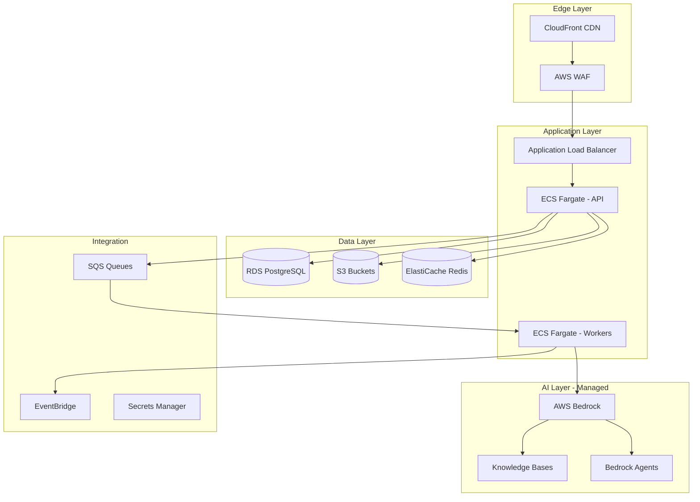
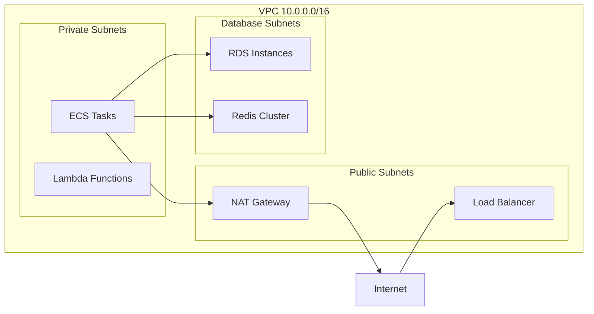
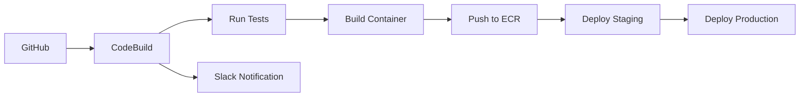
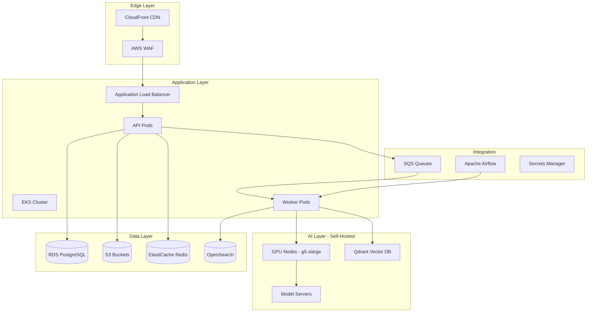
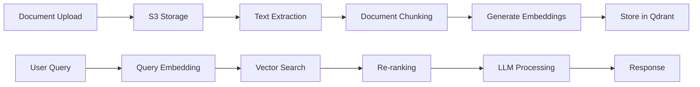
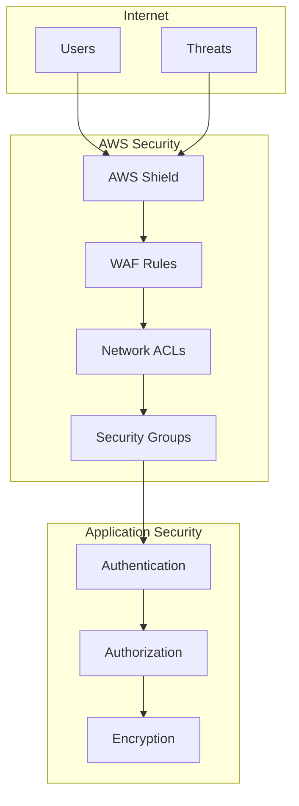
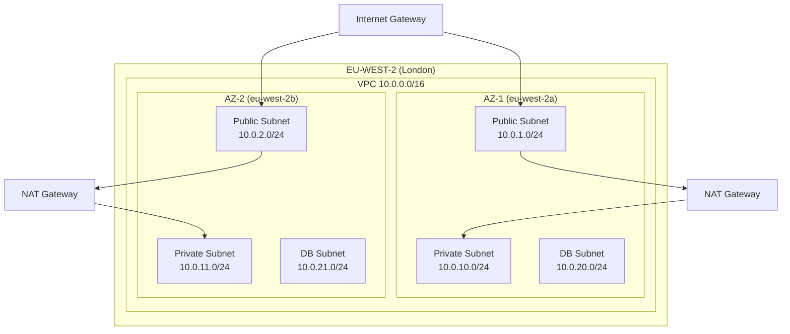
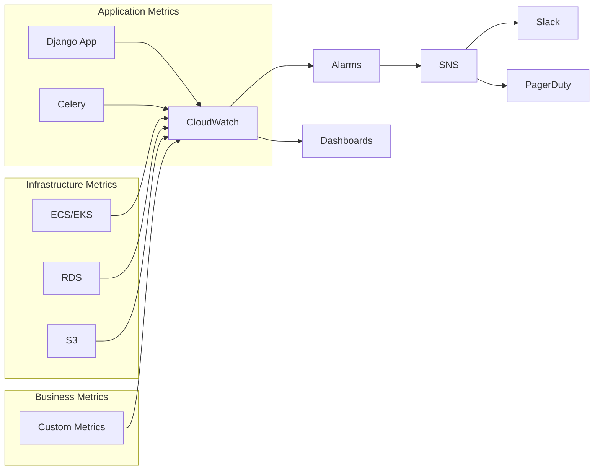
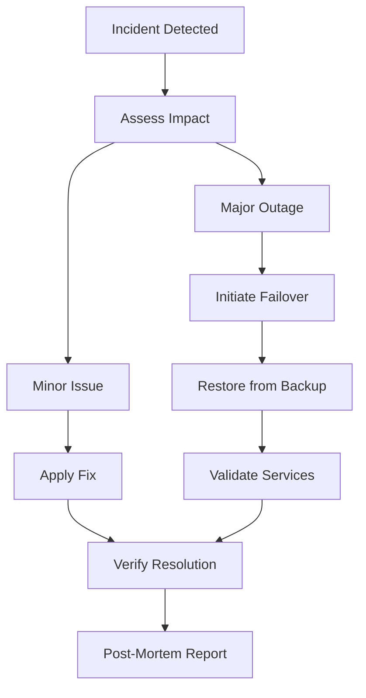

# Infrastructure Design Document

## Document Information

- **Version:** 1.0.0
- **Last Updated:** January 2025
- **Status:** Approved for Implementation
- **Target Sprints:** Sprint 0-1 (Foundation), Sprint 3-5 (OSAE Components)

## Executive Summary

This document defines two infrastructure architectures for Paperwurks: a managed services approach using AWS Bedrock, and a self-hosted approach with custom ML infrastructure. Both designs support the same business requirements but differ in operational complexity and cost structure.

## Business Requirements

### Functional Requirements

- Support 100 concurrent users initially, scaling to 1000+
- Process 50-100 property documents daily
- Sub-30 second AI analysis response time
- 99.9% uptime SLA for core services
- 7-year document retention compliance

### Non-Functional Requirements

- GDPR compliance with UK data residency
- SOC 2 Type II compliance readiness
- RPO: 1 hour, RTO: 4 hours
- Multi-factor authentication support
- End-to-end encryption for sensitive data

## Architecture Option 1: AWS Bedrock-Powered Infrastructure

### Overview

Leverages AWS managed services with Bedrock for AI capabilities, minimizing operational overhead.

### Component Specifications

#### Compute Resources

| Component      | Specification     | Scaling                 | Sprint   |
| -------------- | ----------------- | ----------------------- | -------- |
| API Service    | Fargate 2vCPU/4GB | 2-10 tasks auto-scaling | Sprint 0 |
| Worker Service | Fargate 4vCPU/8GB | 2-5 tasks queue-based   | Sprint 1 |
| Scheduled Jobs | Lambda functions  | On-demand               | Sprint 2 |

#### Managed AI Services

| Service                 | Purpose               | Configuration                 | Sprint   |
| ----------------------- | --------------------- | ----------------------------- | -------- |
| Bedrock Knowledge Bases | RAG document store    | OpenSearch Serverless backend | Sprint 3 |
| Bedrock Agents          | Risk & Legal analysis | Claude 3 Sonnet/Haiku         | Sprint 3 |
| Bedrock Guardrails      | Output filtering      | Custom policies               | Sprint 3 |

#### Data Storage

| Component         | Specification                | Backup Strategy                  | Sprint   |
| ----------------- | ---------------------------- | -------------------------------- | -------- |
| RDS PostgreSQL    | db.t4g.large Multi-AZ        | Daily snapshots, 7-day retention | Sprint 0 |
| S3 Documents      | Standard tier with lifecycle | Cross-region replication         | Sprint 0 |
| ElastiCache Redis | cache.t4g.small              | Daily snapshots                  | Sprint 1 |

### Networking

### Cost Structure (Monthly)

| Component     | Cost Range   | Notes                             |
| ------------- | ------------ | --------------------------------- |
| Compute (ECS) | £200-300     | Includes Fargate Spot for workers |
| Bedrock AI    | £100-200     | Pay per invocation                |
| Database      | £150-200     | Multi-AZ deployment               |
| Storage       | £50-100      | Including CDN                     |
| Networking    | £100-150     | NAT Gateway, data transfer        |
| **Total**     | **£600-950** | Scales linearly with usage        |

### Deployment Pipeline

## Architecture Option 2: Self-Hosted ML Infrastructure

### Overview

Custom-built ML pipeline with self-managed vector database and model serving.

### Component Specifications

#### Kubernetes Cluster

| Component         | Specification   | Node Count       | Sprint   |
| ----------------- | --------------- | ---------------- | -------- |
| Control Plane     | EKS managed     | 3 (HA)           | Sprint 0 |
| API Node Group    | t3.large        | 2-6 auto-scaling | Sprint 0 |
| Worker Node Group | t3.xlarge       | 2-4 auto-scaling | Sprint 1 |
| ML Node Group     | g5.xlarge (GPU) | 1-2 on-demand    | Sprint 3 |

#### Self-Hosted AI Stack

| Service         | Technology            | Infrastructure     | Sprint   |
| --------------- | --------------------- | ------------------ | -------- |
| Vector Database | Qdrant                | 2x m5.xlarge pods  | Sprint 3 |
| Search Engine   | OpenSearch            | 3-node cluster     | Sprint 3 |
| Model Serving   | TorchServe/vLLM       | GPU nodes          | Sprint 4 |
| Embeddings      | Sentence Transformers | CPU intensive pods | Sprint 3 |

### Data Pipeline

### Cost Structure (Monthly)

| Component       | Cost Range       | Notes                 |
| --------------- | ---------------- | --------------------- |
| EKS Cluster     | £300-400         | Include node costs    |
| GPU Instances   | £500-800         | g5.xlarge for ML      |
| Vector DB Nodes | £200-300         | High memory instances |
| OpenSearch      | £250-350         | 3-node cluster        |
| Database        | £150-200         | Same as Option 1      |
| Storage         | £50-100          | Same as Option 1      |
| **Total**       | **£1,450-2,150** | Higher fixed costs    |

## Infrastructure Comparison Matrix

| Aspect                 | Bedrock Architecture | Self-Hosted Architecture | Recommendation |
| ---------------------- | -------------------- | ------------------------ | -------------- |
| Initial Setup Time     | 1-2 weeks            | 4-6 weeks                | Bedrock ✓      |
| Operational Complexity | Low                  | High                     | Bedrock ✓      |
| Monthly Cost (MVP)     | £600-950             | £1,450-2,150             | Bedrock ✓      |
| Scalability            | Automatic            | Manual configuration     | Bedrock ✓      |
| Customization          | Limited              | Full control             | Self-Hosted ✓  |
| Vendor Lock-in         | High                 | Low                      | Self-Hosted ✓  |
| ML Model Options       | AWS models only      | Any model                | Self-Hosted ✓  |
| Maintenance Effort     | Minimal              | Significant              | Bedrock ✓      |

## Security Architecture

### Network Security

### Production Network Topology

### Security Controls

| Layer       | Control               | Implementation          | Sprint   |
| ----------- | --------------------- | ----------------------- | -------- |
| Network     | DDoS Protection       | AWS Shield Standard     | Sprint 0 |
| Network     | WAF                   | OWASP Top 10 rules      | Sprint 0 |
| Application | Authentication        | JWT with refresh tokens | Sprint 1 |
| Application | Authorization         | RBAC with Django        | Sprint 1 |
| Data        | Encryption at Rest    | AES-256                 | Sprint 0 |
| Data        | Encryption in Transit | TLS 1.3                 | Sprint 0 |
| Audit       | Logging               | CloudWatch + CloudTrail | Sprint 0 |

## Monitoring & Observability

### Metrics Collection

### Key Performance Indicators

| Metric                  | Target | Alert Threshold | Dashboard      |
| ----------------------- | ------ | --------------- | -------------- |
| API Latency P95         | <500ms | >1000ms         | Operations     |
| Error Rate              | <0.1%  | >1%             | Operations     |
| AI Processing Time      | <30s   | >60s            | OSAE           |
| Document Upload Success | >99%   | <95%            | Business       |
| Database CPU            | <60%   | >80%            | Infrastructure |
| Cost per Property       | <£5    | >£10            | Finance        |

## Disaster Recovery

### Backup Strategy

| Component          | RPO      | RTO        | Method                 | Frequency  |
| ------------------ | -------- | ---------- | ---------------------- | ---------- |
| Database           | 1 hour   | 2 hours    | Automated snapshots    | Continuous |
| Documents          | 0        | 1 hour     | S3 cross-region        | Real-time  |
| Application Config | 24 hours | 30 minutes | Infrastructure as Code | Daily      |
| Knowledge Bases    | 24 hours | 4 hours    | S3 backup              | Daily      |

### Recovery Procedures

## Implementation Phases

### Phase 1: Foundation (Sprint 0-1)

- VPC and networking setup
- Basic compute infrastructure
- Database provisioning
- CI/CD pipeline
- Monitoring foundation

### Phase 2: Application Platform (Sprint 1-2)

- ECS/EKS cluster setup
- Load balancer configuration
- Auto-scaling policies
- Cache layer implementation
- Message queue setup

### Phase 3: AI Infrastructure (Sprint 3-4)

- Bedrock setup OR Qdrant deployment
- Knowledge base creation
- Model serving infrastructure
- RAG pipeline implementation

### Phase 4: Production Hardening (Sprint 5-6)

- Security audit implementation
- Disaster recovery testing
- Performance optimization
- Cost optimization
- Documentation completion

## Appendix: Compliance Checklist

### GDPR Compliance

- [ ] Data residency in UK/EU
- [ ] Encryption at rest and in transit
- [ ] Right to be forgotten implementation
- [ ] Data portability features
- [ ] Consent management
- [ ] Audit trail for data access

### Security Compliance

- [ ] SOC 2 Type II controls
- [ ] Penetration testing scheduled
- [ ] Vulnerability scanning automated
- [ ] Security incident response plan
- [ ] Business continuity plan
- [ ] Regular security training
